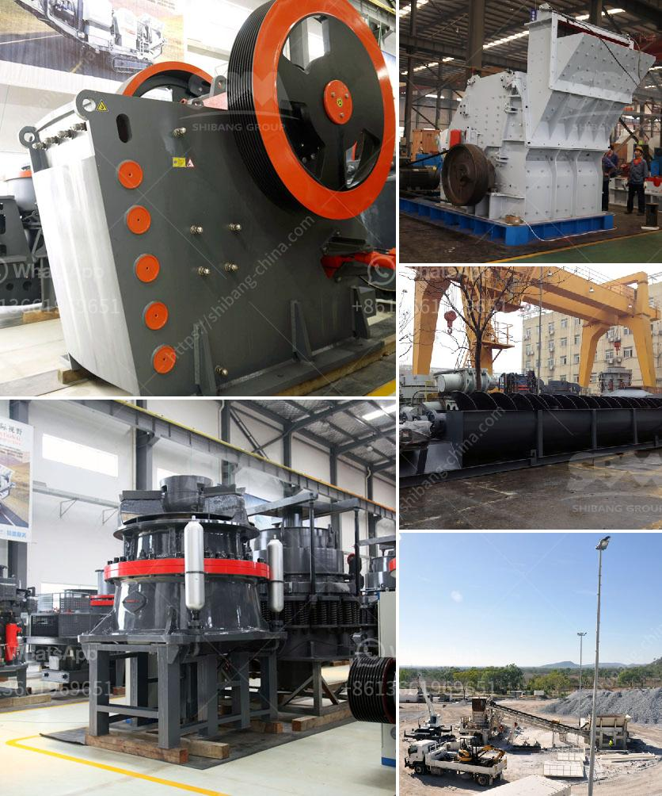

<h3>layout design for stone crushing plant</h3>
The main goal for the design of a crushing plant is an installation that meets the required production requirements, operates at competitive cost, complies with today's tough environmental regulations, and can be built at a reasonable price despite the rising costs of equipment, energy and construction labor.

The fundamental goal for the design of a crushing plant is an installation that meets the required production requirements, operates at competitive cost, complies with today's tough environmental regulations, and can be built at a reasonable price despite the rising costs of equipment, energy and construction labor. The following industry trends must be taken into account:

- Equipment suppliers are offering ever-larger primary crushers, with 1,800 mm (72 in) gyratories expected soon, as well as secondary and tertiary machines of up to 3,000 mm (120 in).

- Rising energy costs are causing owners to increase the integration of mine and mill design, so that they can identify ways of reducing overall electrical power consumption.

- Electronic control of crusher discharge opening and feed rate. With adjustment of a crusher's discharge opening, as the production continues through an on-line coarse size analysis of the crushed product (digital image analyses). Dance, A. 2001)

More attention is being paid to the impact on crushing circuit design caused by variations in ore characteristics, size distribution, moisture content, ore grade and climatic conditions.

With the layout design of a stone crushing plant being selected, the feeding area is required to be emphasized.

- In the design of the crushing plant, raw materials need to be evenly and gradually conveyed to the jaw crusher for primary crushing.

- The conveyor belt system requires sufficient clearance to avoid interference with the operation of the crusher. When designing the layout of the plant, it is necessary to ensure that the equipment and structures are not blocked by other equipment or structures.

- The layout of the crushing plant should be designed with the minimum number of equipment, belt conveyors, screens, and dust collection equipment. The crushing plant design should consider the following factors:

Overall, the layout design for a stone crushing plant should follow the principle of maximizing the productivity, minimizing the operating cost, and reducing the environmental impact. With careful planning and layout design, the selected crushing plant can be utilized to its full potential, ensuring that the entire production process is efficient, reliable, and meets the market demands.
<h3>Contact us</h3><ul><li><strong>Whatsapp:&nbsp;<a href="https://wa.me/8613661969651">+8613661969651</a></strong></li><li><a href="https://swt.shibang-china.com/?git&amp;zhl&amp;layout design for stone crushing plant"><strong>Online Service(chat now)</strong></a></li></ul><h3>Related</h3><ul><li><a href='ball mills for mining technical drawing.md'>ball mills for mining technical drawing</a></li><li><a href='crushing machines of compostable material.md'>crushing machines of compostable material</a></li><li><a href='china processing plants for sale.md'>china processing plants for sale</a></li><li><a href='ball mills as size reduction equipment.md'>ball mills as size reduction equipment</a></li><li><a href='costs of ball mills.md'>costs of ball mills</a></li></ul>