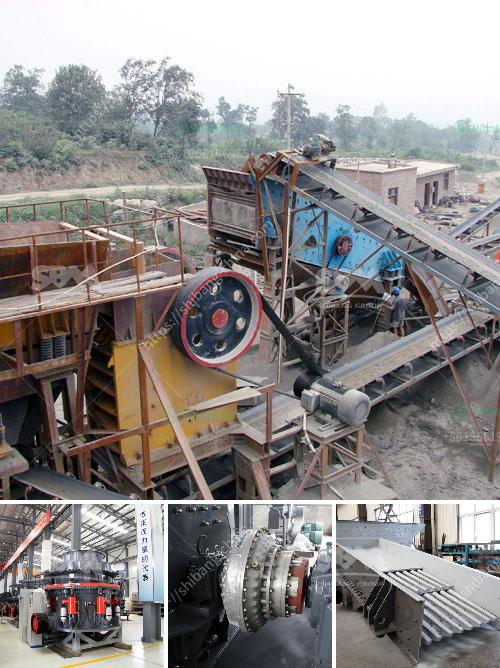

<h3>lime dolomite plant in philippines</h3>
The Philippines, with its fertile lands and diverse agricultural resources, has always been at the forefront of innovation in the farming industry. In recent years, the lime dolomite plant has emerged as a promising agricultural solution, providing farmers with an effective way to enrich their soil and boost crop yields.

The lime dolomite plant utilizes dolomite, a mineral compound rich in calcium and magnesium, as a soil amendment. This plant is specifically designed to produce high-quality lime dolomite powder, which can be used to correct soil acidity levels and improve soil structure.

One of the key benefits of using lime dolomite is its ability to neutralize soil acidity. Acidic soil, often caused by excessive use of chemical fertilizers or natural factors like acid rain, can be detrimental to plant growth and yield. By applying lime dolomite, farmers can balance the pH levels of their soil, creating an optimal environment for plant growth and nutrient absorption.

Furthermore, lime dolomite enhances the availability of essential nutrients, such as nitrogen, phosphorus, and potassium, to plants. It helps break down organic matter in the soil, making it easier for plants to access nutrients and promoting healthier root development. This improved nutrient availability is crucial for the overall health and productivity of crops.

Another advantage of the lime dolomite plant is its sustainability. Dolomite is a naturally occurring mineral, making it a renewable and environmentally friendly resource. By utilizing this abundant mineral, farmers can reduce their reliance on synthetic additives and contribute to a more sustainable agricultural sector.

The lime dolomite plant in the Philippines has gained traction among farmers, with many realizing its potential to revolutionize their farming practices. Its effectiveness in improving soil health, enhancing nutrient availability, and its sustainability make it an attractive solution for farmers.

As the demand for higher crop yields and more sustainable agriculture continues to rise, the lime dolomite plant offers a viable and environmentally friendly option for farmers across the Philippines. With its immense potential to increase productivity and promote soil health, the lime dolomite plant is undoubtedly a valuable addition to the country's agricultural sector.
<h3>Contact us</h3><ul><li><strong>Whatsapp:&nbsp;<a href="https://wa.me/8613661969651">+8613661969651</a></strong></li><li><a href="https://swt.shibang-china.com/?git&amp;zhl&amp;lime dolomite plant in philippines"><strong>Online Service(chat now)</strong></a></li></ul><h3>Related</h3><ul><li><a href='hammer mill sales in zimbabwe.md'>hammer mill sales in zimbabwe</a></li><li><a href='suppliers of coveyor belting in durban.md'>suppliers of coveyor belting in durban</a></li><li><a href='gypsum powder production.md'>gypsum powder production</a></li><li><a href='ball clay crusher manufacturing process.md'>ball clay crusher manufacturing process</a></li><li><a href='small mobile rock pulverizer.md'>small mobile rock pulverizer</a></li></ul>