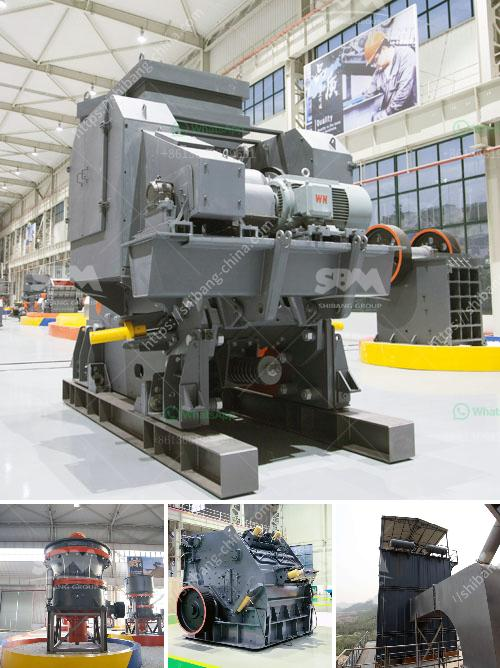

<h3>lime dolomite plant processing</h3>
Lime dolomite is a combination of calcium carbonate and magnesium carbonate, commonly found in limestone deposits. It is widely used in various industries, including agriculture, construction, and environmental applications. The process of lime dolomite plant processing involves several steps to produce high-quality products that meet industry standards. This article provides an overview of lime dolomite plant processing, highlighting its importance and key steps involved.

Lime dolomite is valued for its ability to neutralize acidic soils and regulate pH levels, making it a crucial ingredient in agricultural fertilizers. It helps facilitate plant nutrient absorption, leading to improved crop yields and overall soil fertility. In the construction industry, lime dolomite is used as a flux for steel production, as well as in the production of glass, ceramics, and cement. Additionally, it is utilized in environmental applications to treat acid mine drainage and wastewater.

1. Extraction of Raw Material: Lime dolomite is extracted from limestone deposits through mining. Large blasting equipment is commonly used to break up and transport the raw materials to a processing facility.

2. Crushing and Grinding: The extracted raw material is crushed and ground into a fine powder. This step increases the surface area of the particles, allowing for better chemical reactions during subsequent processing stages.

3. Calcination: The crushed and ground material is then subjected to a high-temperature calcination process in a kiln. This process involves heating the material to a specific temperature, often around 900°C. Calcination helps convert lime dolomite into its active form, calcium oxide (lime), by driving off carbon dioxide and other impurities.

4. Hydration: After calcination, the resulting lime is combined with water to initiate the hydration process. The water reacts with calcium oxide, converting it into calcium hydroxide or slaked lime. This step is essential to produce a water-soluble form of lime.

5. Dolomitization: In order to produce lime dolomite, the hydrated lime (calcium hydroxide) is combined with dolomitic limestone. The dolomitization process involves heating the mixture to a specific temperature, typically around 1100-1200°C. This converts the calcium hydroxide into calcium magnesium oxide, resulting in the formation of lime dolomite.

6. Grinding and Sieving: The lime dolomite product is ground once again to achieve a fine powder consistency. It is then sieved to ensure uniform particle size and eliminate any impurities.

7. Packaging and Distribution: After the final processing steps, the lime dolomite powder is packaged in different sizes and formats, depending on its intended use. It is then ready for distribution to various industries and customers.

In conclusion, lime dolomite plant processing plays a crucial role in catering to the diverse needs of industries such as agriculture, construction, and environmental applications. By following the key steps outlined above, lime dolomite is transformed into a high-quality product that enhances soil fertility, aids in steel production, and supports environmental remediation efforts. The intricate and precise processing methods ensure the production of a consistent and effective material that continues to be in demand worldwide.
<h3>Contact us</h3><ul><li><strong>Whatsapp:&nbsp;<a href="https://wa.me/8613661969651">+8613661969651</a></strong></li><li><a href="https://swt.shibang-china.com/?git&amp;zhl&amp;lime dolomite plant processing"><strong>Online Service(chat now)</strong></a></li></ul><h3>Related</h3><ul><li><a href='dolomite powder mill.md'>dolomite powder mill</a></li><li><a href='construction and crusher machinery crusher machinery.md'>construction and crusher machinery crusher machinery</a></li><li><a href='stone crushing production line.md'>stone crushing production line</a></li><li><a href='conveyor belt equipment for mining south africa.md'>conveyor belt equipment for mining south africa</a></li><li><a href='to buy medium mounted stone crusher in uk.md'>to buy medium mounted stone crusher in uk</a></li></ul>