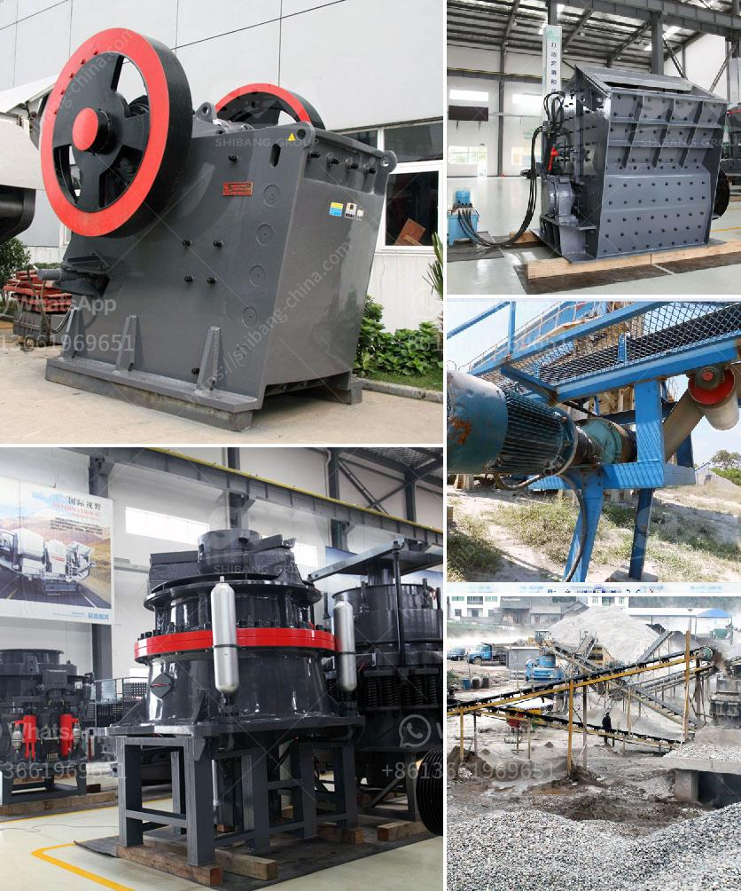

<h3>lime production line price</h3>
Lime production is an essential process in many industries, such as construction, agriculture, and water treatment. As the demand for lime continues to grow, establishing an efficient and cost-effective lime production line becomes crucial for manufacturers. However, determining the price of a lime production line can be a complex task, as it depends on various factors.

One of the primary factors impacting the price of a lime production line is its capacity. Lime production lines are available in different capacities, ranging from small-scale equipment suitable for small businesses to large-scale machinery suitable for heavy industrial use. Naturally, the larger the capacity, the higher the price. Manufacturers should carefully assess their production requirements to ensure they invest in a lime production line that meets their needs without overspending.

The level of automation is another significant factor influencing the price of a lime production line. Modern production lines often incorporate advanced automation technologies to streamline processes, increase productivity, and reduce labor costs. However, automation comes at a higher price. Manufacturers should consider their budget and long-term goals to strike a balance between manual and automated processes in their lime production line.

The quality and durability of equipment also play a crucial role in determining the price. High-quality machinery may come at a higher initial cost but proves more cost-effective in the long run due to reduced maintenance and repair expenses. Manufacturers should prioritize investing in equipment from reputable manufacturers known for their reliability and performance.

Other factors impacting the price of a lime production line include energy efficiency, raw material availability, and environmental regulations. Energy-efficient equipment may have a higher upfront cost but can significantly reduce energy consumption and operational expenses over time. Furthermore, the availability and cost of raw materials needed for lime production can affect the overall production line price.

Finally, manufacturers should consider the after-sales service and technical support provided by lime production line suppliers. Reliable customer support ensures timely assistance in case of any technical issues or maintenance requirements, guaranteeing uninterrupted production and minimizing downtime.

In conclusion, determining the price of a lime production line involves considering several factors, including production capacity, automation level, equipment quality, energy efficiency, raw material availability, and after-sales service. Manufacturers should carefully evaluate these factors to make an informed decision that aligns with their budget and production requirements. By investing in a well-designed and efficient lime production line, manufacturers can boost productivity, reduce costs, and meet the growing demand for lime in various industries.
<h3>Contact us</h3><ul><li><strong>Whatsapp:&nbsp;<a href="https://wa.me/8613661969651">+8613661969651</a></strong></li><li><a href="https://swt.shibang-china.com/?git&amp;zhl&amp;lime production line price"><strong>Online Service(chat now)</strong></a></li></ul><h3>Related</h3><ul><li><a href='small capacity double roller crusher for sale.md'>small capacity double roller crusher for sale</a></li><li><a href='ball mills as size reduction equipment.md'>ball mills as size reduction equipment</a></li><li><a href='used gold crushing for sale in uae.md'>used gold crushing for sale in uae</a></li><li><a href='coal crusher machine manufacturer in india.md'>coal crusher machine manufacturer in india</a></li><li><a href='roller crusher seller.md'>roller crusher seller</a></li></ul>