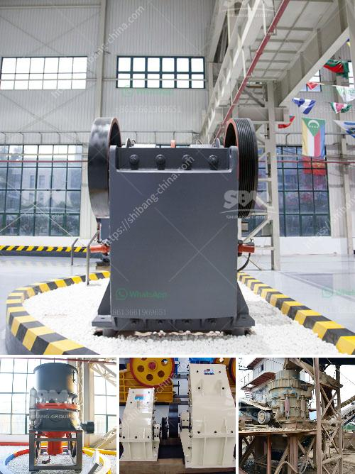

<h3>lime production process</h3>
Lime production is a fascinating process that involves extracting limestone from quarries and transforming it into calcium oxide, also known as quicklime. This versatile material has various applications in industries such as construction, agriculture, and manufacturing.

The lime production process begins with the extraction of limestone from quarries or mines. These rocks, composed mainly of calcium carbonate, are blasted and crushed into smaller pieces. The extracted limestone is then transported to a lime kiln, where it is heated to high temperatures using a variety of fuels, such as coal, natural gas, or even biomass.

Inside the lime kiln, the limestone is subjected to intense heat, typically reaching temperatures of around 900 to 1,200 degrees Celsius. This process, called calcination, causes the limestone to undergo a chemical reaction, resulting in the release of carbon dioxide and the formation of calcium oxide, or quicklime.

The lime kiln is a crucial part of the production process, as it determines the quality and properties of the final product. Various factors, including temperature, residence time, and oxygen availability, influence the calcination process.

Once the quicklime is produced, it is cooled and further processed to meet specific requirements. Quicklime is sometimes hydrated, which means it is mixed with water to produce slaked lime or calcium hydroxide. This hydrated lime has diverse applications, from water treatment to construction.

Lime production is environmentally significant, as it contributes to carbon dioxide emissions due to the release of carbon dioxide during the calcination process. However, the industry has been exploring carbon capture technologies to mitigate its environmental impact.

In conclusion, lime production is a complex and essential process that involves extracting limestone, subjecting it to high temperatures in a lime kiln, and transforming it into calcium oxide. This versatile material finds applications in multiple industries, and its production is a significant contributor to carbon dioxide emissions. Continuous efforts to improve the process's efficiency and environmental impact are crucial for sustainable lime production.
<h3>Contact us</h3><ul><li><strong>Whatsapp:&nbsp;<a href="https://wa.me/8613661969651">+8613661969651</a></strong></li><li><a href="https://swt.shibang-china.com/?git&amp;zhl&amp;lime production process"><strong>Online Service(chat now)</strong></a></li></ul><h3>Related</h3><ul><li><a href='stone crushing contractors california.md'>stone crushing contractors california</a></li><li><a href='manganese ore washing plant and crusher in zambia.md'>manganese ore washing plant and crusher in zambia</a></li><li><a href='portable crushing equipment.md'>portable crushing equipment</a></li><li><a href='ball mill grinding manufacturer in india.md'>ball mill grinding manufacturer in india</a></li><li><a href='cement grinding machine.md'>cement grinding machine</a></li></ul>