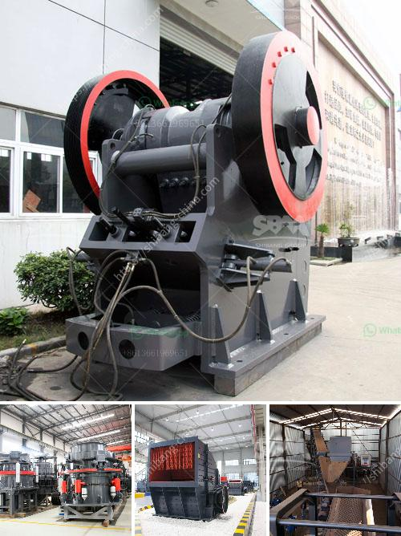

<h3>lime stone crusher in south africa</h3>
Limestone, also known as calcium carbonate, is a sedimentary rock formed by the accumulation of organic remains such as shells and coral. It is abundant in South Africa and is widely used in various industries such as construction, agricultural, and manufacturing.

Limestone is often crushed and used as a raw material for the production of cement. In South Africa, limestone is used extensively in road construction and in the production of concrete. Limestone provides the necessary base material for roads and highways and is also used to create cement.

One of the main reasons for the high demand for limestone in South Africa is the expansion of the construction industry. The country has seen rapid urbanization over the years, resulting in increased infrastructure development. As a result, the demand for construction materials, including limestone, has grown significantly.

To meet this demand, the mining industry in South Africa has been expanding. Limestone deposits are found throughout the country and are mined using large machinery. In the process of mining, limestone is crushed and separated into different sizes for various applications.

A limestone crusher is used to crush limestone into small particles for the production of cement. In South Africa, limestone is mainly crushed in small jaw crusher and impact crusher for primary crushing. The maximum feed size is 420mm and the output size is 20-50mm.

The cement plant in South Africa mainly uses two methods to prepare limestone powder: grinding and precipitated calcium carbonate production. Grinding refers to the process of reducing the particle size of the limestone to such a fine level that it can be directly used as a filling material or additive in cement.

During the grinding process, the limestone is first sent to a jaw crusher to be crushed to a suitable size. Based on the feed size and required product size, the jaw crusher can be equipped with a vibrating feeder or screening equipment to facilitate the transfer of limestone to the grinding mill.

The crushed limestone is then sent to a grinding mill where it is ground to a fine powder. The grinding process is typically carried out in a ball mill, whereby the crushed limestone particles are mixed with water to form a slurry. The slurry is then pumped into the ball mill, where the grinding occurs. After grinding, the slurry is pumped back into a storage tank for further processing.

Another method used to prepare limestone powder is precipitated calcium carbonate (PCC) production. PCC is a synthetic product that is obtained through a chemical reaction between limestone and other chemical compounds. The resultant product is a white powder that can be used in various industries, including cement production.

In conclusion, limestone is a valuable resource in South Africa, which is widely used in the construction industry. To meet the high demand for limestone, the mining industry is expanding and crushers are used to crush the limestone into smaller particles. These particles are then used in the production of cement. With the growth of South Africa's construction industry, the demand for limestone and limestone crushers will continue to rise.
<h3>Contact us</h3><ul><li><strong>Whatsapp:&nbsp;<a href="https://wa.me/8613661969651">+8613661969651</a></strong></li><li><a href="https://swt.shibang-china.com/?git&amp;zhl&amp;lime stone crusher in south africa"><strong>Online Service(chat now)</strong></a></li></ul><h3>Related</h3><ul><li><a href='crusher stone sand making stone quarry.md'>crusher stone sand making stone quarry</a></li><li><a href='working of ball mill in hindi.md'>working of ball mill in hindi</a></li><li><a href='limestone mining process.md'>limestone mining process</a></li><li><a href='japan crushing machine manufacturers list.md'>japan crushing machine manufacturers list</a></li><li><a href='germany stone crusher 30tph.md'>germany stone crusher 30tph</a></li></ul>