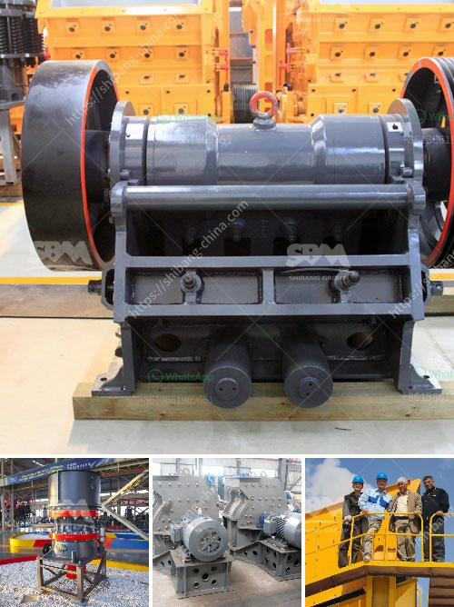

<h3>lime stone powder making machine in india</h3>
Limestone, a sedimentary rock, is made up of calcium carbonate, which eventually forms due to the accumulation of marine organisms such as coral and shells. It has been used for various applications throughout history and is now an integral part of numerous industries. One of the crucial aspects of limestone is its powdered form, which is essential for its utilization across different sectors. In India, the production of limestone powder making machines is significantly thriving, contributing to the country's economic growth.

The process of limestone powder making involves crushing, grinding, and powder classification. The limestone initially goes through the jaw crusher for primary crushing, and then the materials are sent to the impact crusher for secondary crushing with the help of a vibrating feeder. After the crushing stage, the limestone particles are sent to the vibrating screen, where they are separated into different sizes. The limestone of suitable size is conveyed to the Raymond mill, which is a primary grinding mill for further grinding. Here, the limestone undergoes intense grinding to attain the desired powder fineness. Finally, the finely ground limestone powder is stored in a powder silo or sent directly to packing units for packaging and distribution.

India, with its rich limestone reserves, is a major player in the limestone powder making machine industry. Over the years, the country has witnessed an increase in demand for limestone powder across various sectors, including construction, agriculture, and manufacturing. As a result, several companies have emerged, specializing in the production of limestone powder making machines.

The limestone powder making machine manufacturers in India offer a wide range of machines that facilitate the production of limestone powder. These machines are highly versatile, eco-friendly, and energy-efficient, making them capable of processing various grades and particle sizes of limestone. They are also designed with advanced technology and precision, ensuring high-quality output.

One of the leading manufacturers of limestone powder making machines in India is Shanghai Clirik Machinery Co., Ltd. The company manufactures a comprehensive range of grinding equipment, including Raymond mills, ultrafine mills, vertical mills, and hammer mills. These machines are known for their high efficiency, durability, and reliability.

Another prominent manufacturer is Guilin Hongcheng Mining Equipment Manufacture Co., Ltd. They specialize in the production of grinding mills, such as Raymond mills, ultrafine mills, vertical roller mills, and ultrafine vertical mills. Their machines are widely used in the production of limestone powder in India and other countries.

The limestone powder making machine market in India is witnessing significant growth due to the increasing demand for limestone powder. Various industries, such as construction, agriculture, and manufacturing, rely heavily on limestone powder for their operations. The government's emphasis on infrastructure development and initiatives like "Make in India" further contribute to the growth of this industry.

In conclusion, the limestone powder making machine industry in India is thriving. The production of limestone powder machines has boosted the country's economy and provided employment opportunities. As the demand for limestone powder continues to grow, manufacturers are developing advanced and efficient machines to meet the needs of various industries. With its abundant limestone reserves and growing market, India is poised to remain a key player in the limestone powder making machine industry.
<h3>Contact us</h3><ul><li><strong>Whatsapp:&nbsp;<a href="https://wa.me/8613661969651">+8613661969651</a></strong></li><li><a href="https://swt.shibang-china.com/?git&amp;zhl&amp;lime stone powder making machine in india"><strong>Online Service(chat now)</strong></a></li></ul><h3>Related</h3><ul><li><a href='mobil crusher plant in usa.md'>mobil crusher plant in usa</a></li><li><a href='belt cost conveyor.md'>belt cost conveyor</a></li><li><a href='philippines crusher equipment.md'>philippines crusher equipment</a></li><li><a href='iron ore processing equipment in mexico.md'>iron ore processing equipment in mexico</a></li><li><a href='india quartz powder manufacture.md'>india quartz powder manufacture</a></li></ul>