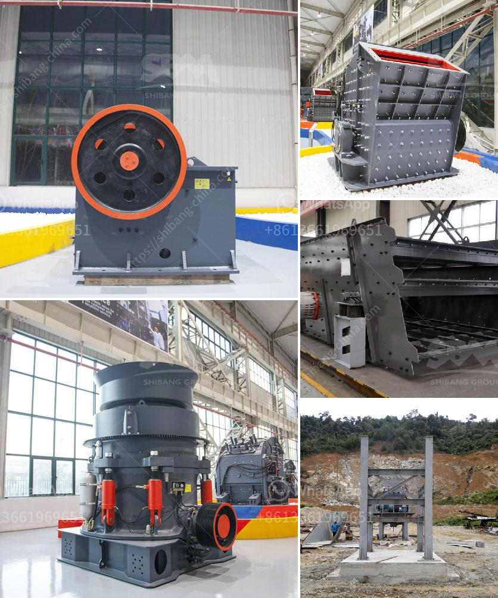

<h3>limestone ball mill machine</h3>
Limestone ball mill machine is a type of grinding mill, purposed similarly to the sag mill or other mining crushers. Ball grinding machine are used to grind or mix metals or raw materials for further processing. Various materials are placed into the mill drum and rotated with the mined materials that are to be crushed. The ball mill machine usually coordinates with other rock crusher machines, like jaw crusher, cone crusher, to reduce the ore particle into fine and superfine size.

Ball mills grinding tasks can be done under dry or wet conditions. Get to know more details of rock crushers, ore grinders, contact us!

【Ball mill parts】 feed, discharge, barrel, gear, motor, reducer, bearing, bearing seat, frame, liner plate, steel ball, etc.

The working principle of ball mill machine is simple: the materials enter the grinding chamber evenly through the feeder. Then the centrifugal force produced by the rotating barrel of the ball mill machine evenly spreads the materials to the next working procedure. The crushed materials will be discharged through the discharging grate plate to complete the grinding process.

3. Automatization 4. Working Continuously 5. Quality guarantee, safe operation, energy-saving. The ball grinding mill machine usually coordinates with other rock crusher machines, like jaw crusher, cone crusher, to reduce the ore particle into fine and superfine size. The largest grinding mill for copper ore - High efficient wet type grinding quipment which widely used in mining and processing industry.

Ball mill is a kind of ore grinding processing machinery commonly used in ore milling. The main function of the steel ball in the ball mill is to impact and crush the material, and also play a certain grinding effect. Therefore, the purpose of grading steel balls is to meet the requirements of these two aspects. The quality of the crushing effect directly affects the grinding efficiency, and ultimately affects the output of the ball mill. Whether the crushing requirement can be achieved depends on whether the grading of the steel ball is reasonable, mainly including the size of the steel ball, the number of ball diameters, and the ball of various specifications. Proportion, grading method, etc.

Limestone ball mill machine is a key working machine on the other hand, the grate type contains a grinding chamber at the bottom, containing a certain quantity of balls, varying in size and made up of various materials. Thematerial is fed evenly through a rotating drum and discharged through a door or ramp. The inside mill is filled with grinding media. The grinding mill rotates about once every couple of seconds. The grinding medium may be steel rods, balls, or rock itself.

Properly done, the vessel will contain anywhere from 20-40% of empty space. The number of media beads

4. Rotational speed: changes direction at specific intervals, causing the grinding media to roll or rotate in different directions.

5. Stirred velocity: constant. Use of zirconium oxide grinding media (made by Yttrium Stabilized Zirconia). They are showing high crushing efficiency even for grinding materials with a relatively high hardness. The following grinding media are recommended for effective grinding when milling: alumina grinding media, zirconium silicate grinding media, zirconia toughened alumina grinding stone media, ytz grinding media, and media made from other alloys

The limestone ball mill machine is mainly composed of an integral motor, seat, motor frame, and transmission device. The grinding body is generally made of steel balls, steel forgings, steel rods, gravel, and pebbles. The limestone ball mill machine is characterized by high grinding efficiency, large production capacity, and low operation cost.

In this case, ZJH minerals provide head liner, shell liner and accessories for limestone ball mill: shell plate, head plate, bayonet plate, backing plate, head wedge plate, ring nut, wedge plug, slab bolt, square head bolt, ring gear, etc., can customize grinding media linings, can Supply finished products with various patterns (straight wave lines, waves, herringbone shapes, etc.), linings with different materials such as quartz grinding media lining, ceramic grinding media lining, etc.

In conclusion, the limestone ball mill machine is a high-yield fine grinding equipment, which is popular both in the field of industrial milling and the mining industry. The working principle of the limestone ball mill machine is to continuously and uniformly feed the material into the grinding chamber of the grinding machine through the joint feeder, and the finished material is screened, and the pulverized powder is ground by the grinding body, and then the powder is discharged. The outer flow of the mill is collected and collected by the dust collector. If you are interested in a limestone ball mill machine, please contact us.
<h3>Contact us</h3><ul><li><strong>Whatsapp:&nbsp;<a href="https://wa.me/8613661969651">+8613661969651</a></strong></li><li><a href="https://swt.shibang-china.com/?git&amp;zhl&amp;limestone ball mill machine"><strong>Online Service(chat now)</strong></a></li></ul><h3>Related</h3><ul><li><a href='how much does a crusher.md'>how much does a crusher</a></li><li><a href='river sand suppliers in northern cape.md'>river sand suppliers in northern cape</a></li><li><a href='crusher for sale in dubai.md'>crusher for sale in dubai</a></li><li><a href='price of crushed stone in ethiopia.md'>price of crushed stone in ethiopia</a></li><li><a href='quartz manufacturing plant.md'>quartz manufacturing plant</a></li></ul>