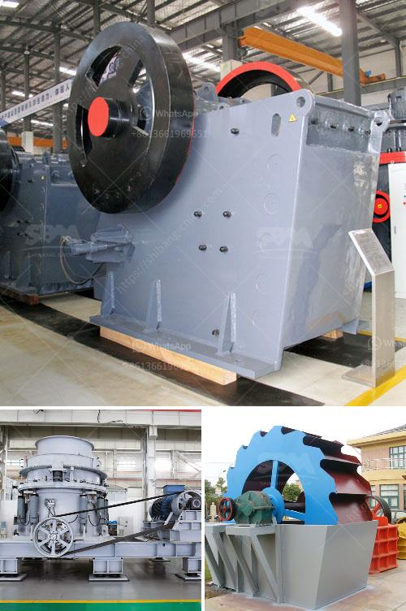

<h3>limestone crusher kenya</h3>
Limestone is a sedimentary rock that is mainly composed of calcium carbonate (calcite) crystals. The calcium carbonate content in the limestone makes it a valuable material for various industries like construction, agriculture, and manufacturing. In Kenya, limestone is mined in areas such as Mombasa, Nairobi, Athi River, and the Tana River County.

To process limestone into construction materials, the limestone crushing machines like jaw crusher, cone crusher, and impact crusher play an important role in the crushing process. They can crush the raw limestone into smaller sizes for further processing. That is why limestone crusher Kenya is quite popular among construction companies.

As we all know, limestone has wide applications, such as in the construction industry, road construction, and aggregate production. Therefore, limestone crushers are widely used in Kenya to produce high-quality aggregates for construction projects.

The limestone crusher Kenya is exceptionally reliable for crushing a variety of materials in the cement industry, mining, and quarrying industries. Its capacity to crush hard materials is excellent, and the final product is of good quality and shape. It is widely used in road construction, building construction, chemical industry, and other industries where limestone is needed.

Additionally, the limestone crusher Kenya is easy to operate and maintain. It has a simple structure, and the investment cost is relatively low compared to other crushers in the market. Moreover, the operating cost is low due to its high efficiency and energy-saving features.

In conclusion, the limestone crusher Kenya is a reliable and cost-effective option for processing limestone into usable products. It is ideal for construction companies and quarry owners who want to crush limestone materials for further utilization. With its high crushing ratio, excellent performance, and user-friendly design, the limestone crusher Kenya is a valuable asset in any crushing operation.
<h3>Contact us</h3><ul><li><strong>Whatsapp:&nbsp;<a href="https://wa.me/8613661969651">+8613661969651</a></strong></li><li><a href="https://swt.shibang-china.com/?git&amp;zhl&amp;limestone crusher kenya"><strong>Online Service(chat now)</strong></a></li></ul><h3>Related</h3><ul><li><a href='mobile mining gold equipment.md'>mobile mining gold equipment</a></li><li><a href='vibrating screens for material crusher.md'>vibrating screens for material crusher</a></li><li><a href='small sand washing machine.md'>small sand washing machine</a></li><li><a href='calculation of crushing plant.md'>calculation of crushing plant</a></li><li><a href='india herzog pulverizer hp m 100 p venta.md'>india herzog pulverizer hp m 100 p venta</a></li></ul>