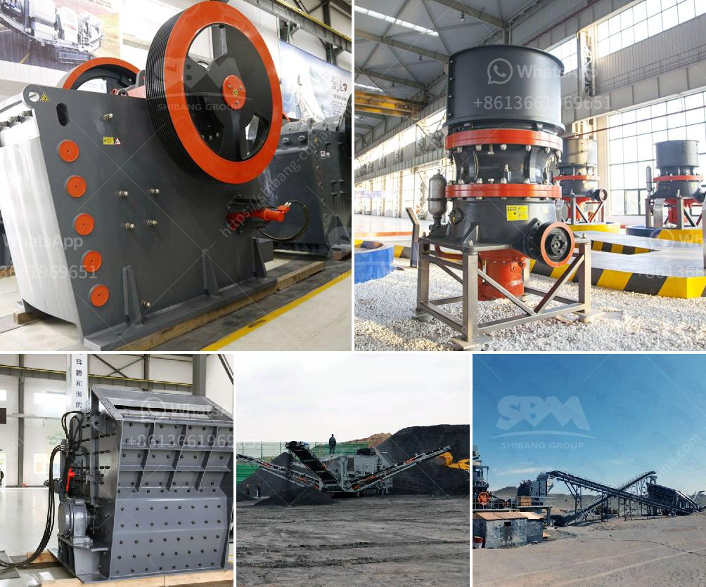

<h3>limestone crushing machine</h3>
Limestone is a sedimentary rock that is composed mainly of calcium carbonate (CaCO3). The rock forms from the gradual accumulation of skeletal remains of marine organisms such as coral and mollusks. Limestone is commonly used as a building material and it is also an important raw material for many industrial purposes such as manufacturing cement, lime, and mineral fillers.

To obtain limestone, it is first quarried, then crushed and screened to separate the limestone particles into useful products of various sizes. The crushing process includes two stages: primary crushing and secondary crushing. Jaw crushers or gyratory crushers are often utilized for primary crushing, and cone crushers are popular for secondary and tertiary crushing.

When it comes to crushing limestone, the machines that are often used in limestone crushing include jaw crushing equipment, impact crushing equipment, and cone crushing equipment. Jaw crushers are responsible for primary crushing, and they are designed with large jaws that can handle significant amounts of material. The main advantage of jaw crushers is their simplicity and reliability.

Impact crushers, on the other hand, are used for secondary or tertiary crushing. They consist of a rotor that rotates at a high speed, and when the feed material enters the chamber, it is struck by the rotating hammers. This impact causes the material to break into smaller pieces, which are then discharged through the bottom of the machine. Impact crushers are known for producing high-quality cubical end products.

Cone crushers, on the other hand, are suitable for secondary and tertiary crushing. They consist of a cone-shaped chamber that provides a large crushing ratio and an eccentrically rotating spindle. The material is crushed between the mantle and the concave, and the crushed material is discharged through the bottom of the machine. Cone crushers are known for their versatility and efficiency.

In conclusion, limestone crushing machines are vital to the limestone quarrying process. Whether it is used as road base or aggregate, limestone is a crucial resource for many construction projects. Therefore, it is important to choose a suitable limestone crusher machine based on the specific needs of your project to ensure that your operation runs smoothly and efficiently.
<h3>Contact us</h3><ul><li><strong>Whatsapp:&nbsp;<a href="https://wa.me/8613661969651">+8613661969651</a></strong></li><li><a href="https://swt.shibang-china.com/?git&amp;zhl&amp;limestone crushing machine"><strong>Online Service(chat now)</strong></a></li></ul><h3>Related</h3><ul><li><a href='vertical roll mill.md'>vertical roll mill</a></li><li><a href='crush granite to powder.md'>crush granite to powder</a></li><li><a href='america stone crusher price.md'>america stone crusher price</a></li><li><a href='gold crusher plant for sale australia.md'>gold crusher plant for sale australia</a></li><li><a href='ball mill grinder canada.md'>ball mill grinder canada</a></li></ul>