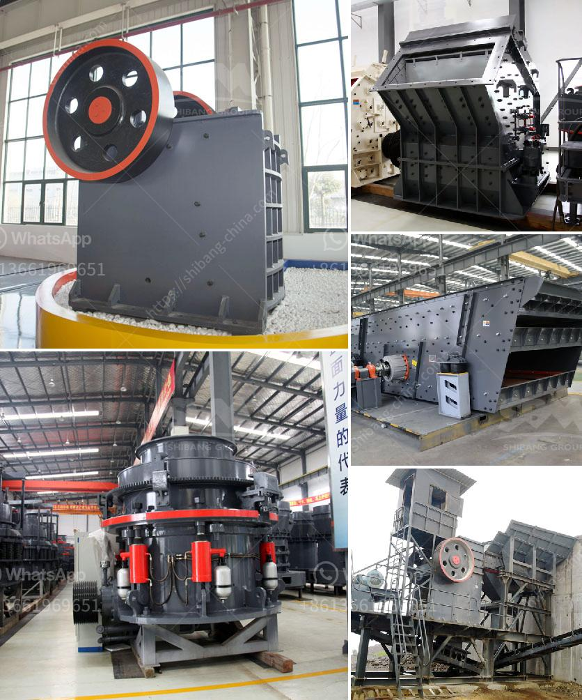

<h3>limestone crushing plant input and output size</h3>
Limestone is an important raw material for construction and many other industries. If we want to make full use of limestone resources, we need to crush it into different sizes for various applications. With the increasing development of infrastructure and construction projects, the demand for limestone products is increasing, and the limestone crushing plant is essential equipment for limestone processing. Limestone crushing plant is a combined stone crushers which may consists of different configurations: some are mainly for the M sand making, some are for the screening while some are mainly for washing process. so we can find that the main equipment for the process are M sand making manufacturing machine, sand washing machine, sand screening machine, and the VSI sand making machine is the crucial equipment in the limestone crushing plant.

The limestone crushing plant is a kind of equipment for crushing the hardness of limestone. Limestone crusher can directly crush the material with a grain size of 600-1800 mm to a section of crusher with a grain size of 25 or less. Limestone is widely applied in various industrial fields because of its wide distribution and easy access in nature. There are several types of rock crusher machine can process limestones, such as fixed jaw crusher, impact rock crusher machine, hammer crusher machine, and hydraulic cone crusher machine.

The fixed jaw crusher is the most commonly used crushing equipment in rock crushing plants and quarries. Fixed jaw crusher is mainly used for coarse crushing in primary crushing process, which is suitable for crushing hard rock, river pebble, granite, basalt and other relatively large hardness raw materials. Compared with the traditional PE jaw crusher, the JC series jaw crusher has a completely designed crushing chamber, which makes the maximum feeding size realize 1100mm, which is far beyond the traditional jaw crusher's feeding size. With a rotation speed of 275rpm, the JC-840*1100 is regarded as one of the highest configuration secondary jaw crushing equipment, and can crush limestone of maximum size 1000mm to 40mm.

However, cone crusher is a better choice when it comes to hardness and abrasiveness, such as granite, basalt, and quartz etc. Cone crusher, as the varieties of crushers used in limestone tailings crushing process and recycling applications, has a wide range of applications in the construction industry. Hongxing Machinery cone crusher machine can be divided into single-cylinder hydraulic cone crusher and multi-cylinder hydraulic cone crusher. And the final products, manufactured by these machines, are not only beautiful, but also have better grain shape and higher crushing efficiency.

In conclusion, the limestone crushing plant aimed at different application needs, including crushing limestone for aggregate or sand, crushing limestone for construction and road building, crushing limestone for industrial raw materials, etc. With the modernization of the construction industry and the increasing demand for materials, the proportion of crushed stone or sand needs in the total output value of construction industry is also increasing. Therefore, the limestone crushing plant with output sizes adjusted to meet different market demands can be a wise choice for contractors.
<h3>Contact us</h3><ul><li><strong>Whatsapp:&nbsp;<a href="https://wa.me/8613661969651">+8613661969651</a></strong></li><li><a href="https://swt.shibang-china.com/?git&amp;zhl&amp;limestone crushing plant input and output size"><strong>Online Service(chat now)</strong></a></li></ul><h3>Related</h3><ul><li><a href='small ore grinding mill with 50 tpd for sale.md'>small ore grinding mill with 50 tpd for sale</a></li><li><a href='stone crusher plant in punjab.md'>stone crusher plant in punjab</a></li><li><a href='mini cement plants manufacturer africa.md'>mini cement plants manufacturer africa</a></li><li><a href='stone crush rate in islamabad.md'>stone crush rate in islamabad</a></li><li><a href='sand wash plant for sale in india.md'>sand wash plant for sale in india</a></li></ul>