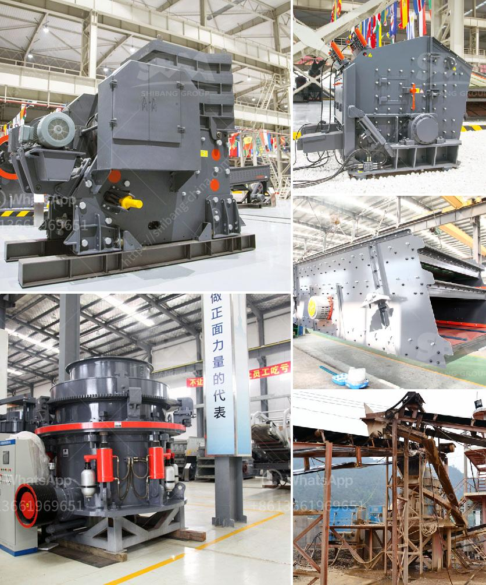

<h3>limestone grinding mill unit</h3>
Limestone is a sedimentary rock composed mainly of calcium carbonate (CaCO3). This rock occurs naturally in various forms, such as chalk, limestone, and marble. It is used in many industries for various purposes, including building materials, cement production, agriculture, and soil stabilization.

To utilize limestone in the form of a fine powder, many industries use limestone grinding mills. These mills help to break limestone into smaller particles that can be used in various applications. The limestone grinding mill unit is a well-known grinding equipment in the industry designed to grind limestone into fine powder.

Limestone grinding mill unit has a strong production capacity and can create high-quality fine powder. It features a relatively compact design, making it efficient and easy to operate. This grinding unit can be used in various grinding processes, such as dry grinding or wet grinding. It can grind various materials, including limestone, quartz, feldspar, calcite, barite, dolomite, marble, and gypsum.

The limestone grinding mill unit employs high-quality grinding roller assemblies and advanced grinding technology. The grinding roller assembly, made of high-quality materials, ensures the stability and durability of the equipment. The advanced grinding technology used in the mill unit helps to achieve higher grinding efficiency and produce finer powder.

There are several advantages to using a limestone grinding mill unit. Firstly, it reduces the transportation cost of limestone. Instead of transporting bulk limestone, which is heavy and expensive, industries can grind it into fine powder at the production site. This saves transportation costs and facilitates the use of limestone in various applications.

Secondly, the limestone grinding mill unit improves the utilization rate of limestone. By grinding limestone into fine powder, industries can use it in a wide range of applications, such as the production of cement, building materials, and soil stabilization. Fine limestone powder has more surface area, allowing it to react more efficiently with other materials.

Lastly, the limestone grinding mill unit is environmentally friendly. The grinding process doesn't produce harmful emissions or waste materials. Additionally, the unit is designed to minimize noise levels, creating a comfortable working environment.

In conclusion, the limestone grinding mill unit is a versatile and efficient grinding equipment used to grind limestone into fine powder. It can be used in various industries for different purposes, such as cement production, building materials, and soil stabilization. The unit features high-quality grinding roller assemblies and advanced grinding technology, ensuring high grinding efficiency and fine powder production. Additionally, using a limestone grinding mill unit reduces transportation costs and enhances the utilization rate of limestone. This makes it a valuable tool for industries that rely on limestone as a raw material.
<h3>Contact us</h3><ul><li><strong>Whatsapp:&nbsp;<a href="https://wa.me/8613661969651">+8613661969651</a></strong></li><li><a href="https://swt.shibang-china.com/?git&amp;zhl&amp;limestone grinding mill unit"><strong>Online Service(chat now)</strong></a></li></ul><h3>Related</h3><ul><li><a href='micron grinding manufacturer.md'>micron grinding manufacturer</a></li><li><a href='crushing asphalt with jaw crusher.md'>crushing asphalt with jaw crusher</a></li><li><a href='pulverizer crusher machine for coal.md'>pulverizer crusher machine for coal</a></li><li><a href='quarry impact crusher equipment.md'>quarry impact crusher equipment</a></li><li><a href='price hammer crusher nigeria.md'>price hammer crusher nigeria</a></li></ul>