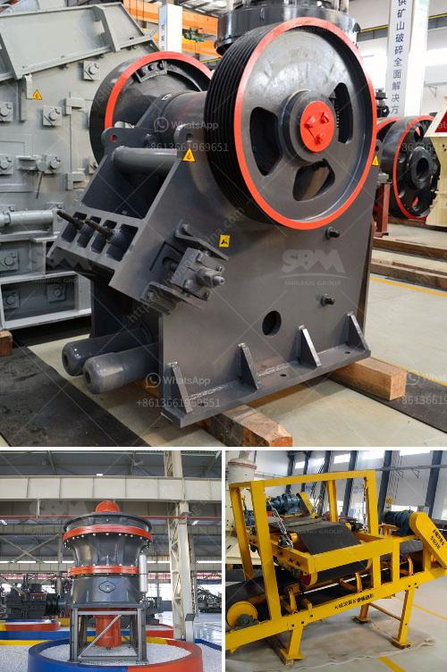

<h3>limestone manufacturer supplier egypt</h3>
Egypt is one of the oldest civilizations in the world, and its rich history has contributed to the construction industry that we see today. Limestone is a sedimentary rock that has been used in building structures and monuments for centuries, and Egypt is home to some of the most incredible limestone creations in history, such as the Great Sphinx and the Pyramid of Giza.

Limestone manufacturers and suppliers in Egypt play a significant role in enhancing the construction industry worldwide. These companies extract limestone from quarries, process it into various forms, and supply it to different regions for construction purposes. With their expert knowledge and experience, they ensure that the limestone meets the required quality standards.

Egyptian limestone is known for its durability, strength, and aesthetic appeal. It can be used for various applications, including cladding, flooring, countertops, and outdoor paving. The versatility of limestone makes it a popular choice among architects, designers, and builders globally. Not only does it provide a timeless and elegant look, but it also offers excellent thermal insulation properties.

Additionally, limestone suppliers in Egypt are committed to sustainable practices. They understand the importance of preserving the environment and ensure responsible mining and manufacturing processes. By adhering to international standards, they minimize their carbon footprint and reduce the impact on surrounding ecosystems.

The limestone industry in Egypt is highly competitive, with numerous manufacturers and suppliers offering a wide range of products to cater to different project requirements. These companies invest in modern technology and equipment to extract limestone efficiently and produce high-quality products. They also have a dedicated team of professionals who provide technical assistance, ensuring that customers find the right limestone type for their specific needs.

In conclusion, limestone manufacturer suppliers in Egypt are instrumental in shaping the construction industry globally. Their expertise, commitment to quality, and sustainable practices make them reliable partners for builders and architects. The timeless beauty, strength, and versatility of Egyptian limestone continue to inspire and enhance architectural marvels worldwide.
<h3>Contact us</h3><ul><li><strong>Whatsapp:&nbsp;<a href="https://wa.me/8613661969651">+8613661969651</a></strong></li><li><a href="https://swt.shibang-china.com/?git&amp;zhl&amp;limestone manufacturer supplier egypt"><strong>Online Service(chat now)</strong></a></li></ul><h3>Related</h3><ul><li><a href='ball mill outpot capicity 180 tph.md'>ball mill outpot capicity 180 tph</a></li><li><a href='cost of conveyor belt system for coal loading.md'>cost of conveyor belt system for coal loading</a></li><li><a href='quarry making machine from south africa.md'>quarry making machine from south africa</a></li><li><a href='stone crusher machine price in ethiopia.md'>stone crusher machine price in ethiopia</a></li><li><a href='sand and gravel crusher suppliers located in cebu.md'>sand and gravel crusher suppliers located in cebu</a></li></ul>