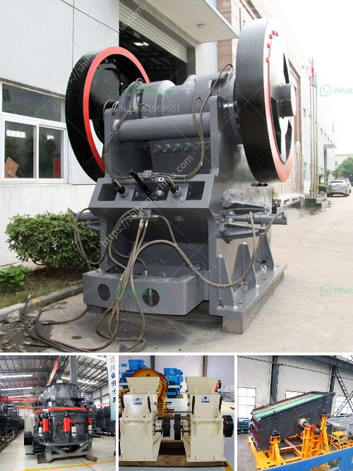

<h3>limestone mines in ethiopia</h3>
Limestone is an important raw material for various industries. Ethiopia is one of the countries in the world that is endowed with extensive limestone deposits. Limestone mines in Ethiopia have been vital sources for construction materials like cement, as well as other industrial and chemical applications.

The country also has huge limestone reserves, which have further attracted various investors. Several limestone mines are currently operational in Ethiopia, providing employment opportunities and contributing to the country's overall economic growth.

One notable limestone mine in Ethiopia is the Dangote Cement Ethiopia PLC, which has production capacity of 2.5 million tons of limestone per year. The mine is located in Mugher, an area within the Oromia region of Ethiopia. This mine has contributed significantly to Ethiopia's cement industry, catering to both domestic demand and export.

Limestone mines in Ethiopia also play a crucial role in preserving the country's cultural heritage. The renowned rock-hewn churches of Lalibela, a UNESCO World Heritage site, are a testament to the significance of limestone as a construction material. These ancient churches were carved out of solid limestone rock centuries ago and are still admired for their intricate architecture and historical importance.

However, it is also important to acknowledge the environmental concerns associated with limestone mining. Excavation activities can result in landscape alteration, soil erosion, and potential water pollution if not managed properly. It is crucial for mining companies in Ethiopia to prioritize sustainable practices and adhere to strict environmental regulations to minimize negative impacts.

In conclusion, limestone mines in Ethiopia play a vital role in the country's construction, industrial, and cultural sectors. These mines provide essential raw materials for cement production, employment opportunities, and contribute to Ethiopia's economic growth. However, responsible mining practices and environmental conservation should go hand in hand to ensure sustainable development and minimize negative impacts on the surrounding ecosystem.
<h3>Contact us</h3><ul><li><strong>Whatsapp:&nbsp;<a href="https://wa.me/8613661969651">+8613661969651</a></strong></li><li><a href="https://swt.shibang-china.com/?git&amp;zhl&amp;limestone mines in ethiopia"><strong>Online Service(chat now)</strong></a></li></ul><h3>Related</h3><ul><li><a href='process of river rock crushing to make cement.md'>process of river rock crushing to make cement</a></li><li><a href='ball mill machine products from china.md'>ball mill machine products from china</a></li><li><a href='ball mills for rent.md'>ball mills for rent</a></li><li><a href='conveyor belt hangzhou.md'>conveyor belt hangzhou</a></li><li><a href='prices for cement processing machines.md'>prices for cement processing machines</a></li></ul>