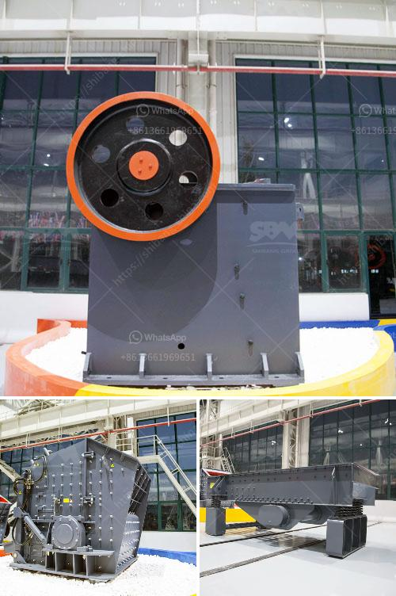

<h3>limestone mining process</h3>
Limestone mining is a relatively simple process which can be followed by any individual with basic mining knowledge and guidance. It involves extracting limestone from open pits and underground mines with the help of heavy machinery.

The first step in limestone mining is to find a suitable deposit. This can be done by searching the Internet for limestone mines or by conducting a geological survey. Once a suitable deposit is identified, the next step is to obtain legal permission to mine. This involves obtaining the necessary permits and licenses from the government or relevant authority.

Once all the legalities are in place, the actual mining process begins. The process starts by removing the top layer of soil and vegetation to expose the limestone deposit. This is often done using bulldozers or other heavy machinery. The removed top layer or overburden is then stored separately as it can be later used for reclamation of the site.

After the top layer is removed, the limestone deposit is accessed by drilling and blasting. Holes are drilled into the rock and explosives are inserted. These explosives are then detonated to break the limestone into smaller pieces. This process is carefully controlled to ensure the safety of the workers and to minimize environmental impact.

Once the limestone is blasted, it is loaded onto trucks or conveyor belts and transported to the processing plant. At the processing plant, the limestone is crushed into smaller pieces by heavy machinery. The crushed limestone is then sorted into different sizes by screening. The limestone is then stored in silos or stockpiles for further processing.

In the next stage of the process, limestone is heated in a kiln to produce lime. This is known as the calcination process. The kiln is a large cylindrical structure with a flame at one end. The limestone is slowly fed into the kiln from the top. As it moves down the kiln, it is gradually heated to high temperatures of around 900-1000 degrees Celsius. The heat causes the limestone to chemically react and release carbon dioxide, leaving behind lime.

The final step in the limestone mining process is the packaging and distribution of the lime. The lime is packaged into bags or bulk containers depending on the needs of the customer. It is then transported to various industries such as construction, agriculture, and manufacturing for use in a wide range of applications.

Limestone mining is an important process that contributes to the development and prosperity of a region. It provides jobs to local communities and brings economic benefits through taxes and royalties paid to the government. Moreover, limestone is a versatile material used in various industries, including construction, agriculture, and manufacturing.

While limestone mining has its benefits, it is important to ensure responsible mining practices to minimize environmental impact. This includes proper reclamation of the land after mining is completed, reducing dust and noise pollution, and implementing safety measures to protect the workers.

In conclusion, limestone mining is a relatively straightforward process that involves extracting limestone from open pits or underground mines. The limestone is then crushed, sorted, and heated to produce lime, which is used in a variety of applications. Responsible mining practices are essential to ensure the sustainable development of limestone resources while minimizing environmental impact.
<h3>Contact us</h3><ul><li><strong>Whatsapp:&nbsp;<a href="https://wa.me/8613661969651">+8613661969651</a></strong></li><li><a href="https://swt.shibang-china.com/?git&amp;zhl&amp;limestone mining process"><strong>Online Service(chat now)</strong></a></li></ul><h3>Related</h3><ul><li><a href='material composition for coal screen.md'>material composition for coal screen</a></li><li><a href='clay processing techniques.md'>clay processing techniques</a></li><li><a href='limestone small crusher machine.md'>limestone small crusher machine</a></li><li><a href='crusher processing plant malaysia.md'>crusher processing plant malaysia</a></li><li><a href='coal mill company in srilanka.md'>coal mill company in srilanka</a></li></ul>