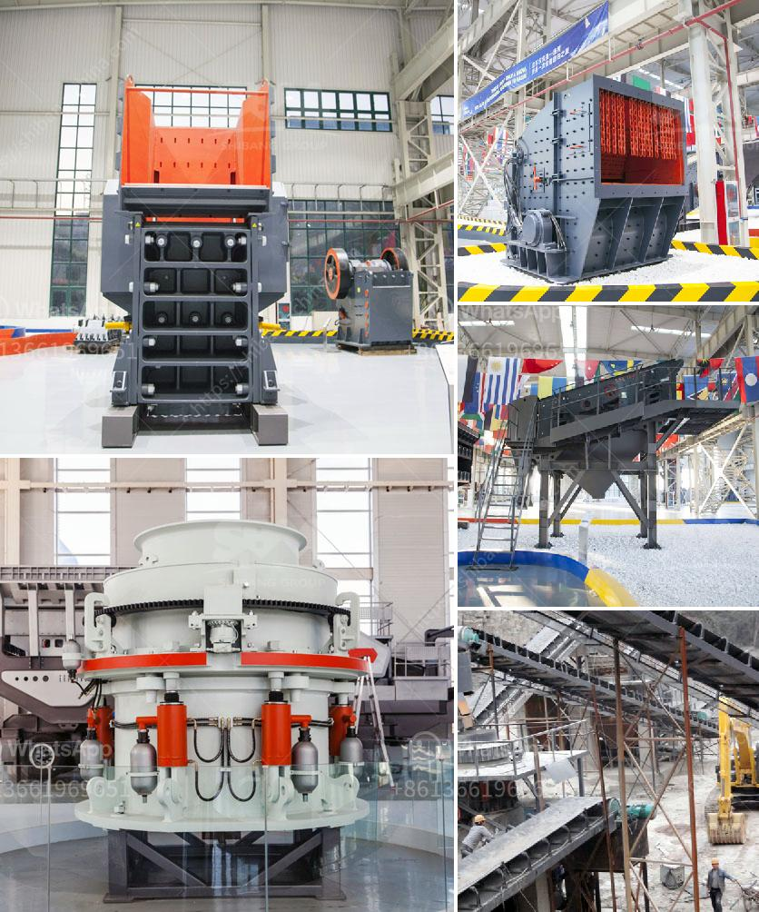

<h3>limestone powder making machine india</h3>
Limestone is a common natural stone that is widely used in various industries, including construction, agriculture, and the chemical industry. With the rapid development of these industries, the demand for limestone powder has been increasing.

Limestone powder is commonly used as a raw material in the production of cement, concrete, and various other construction materials. It is also used in agriculture as a soil conditioner and fertilizer to enhance soil quality and promote plant growth. Additionally, limestone powder is used in the chemical industry for the production of chemicals and other compounds.

To meet the growing demand for limestone powder, various manufacturers have introduced limestone powder making machines in India. These machines are widely used in various industries for grinding limestone into powder, ensuring a consistent particle size distribution and quality.

The limestone powder making machines in India are comprised of the main machine, blower, analyzer, dust collector, and piping system. Depending on the specific requirements of the clients, these machines can be combined or separated into different stages of the process. The feed limestone is first crushed into small particles and then mixed with other materials in the correct proportions to achieve the desired composition.

The main machine in the limestone powder making machine is the grinding mill. It is typically designed to grind limestone into fine powder, ensuring a high-quality final product suitable for various applications. The grinding mill can vary in size and capacity, with some machine sizes ranging from small scale to large-scale industrial mills.

The limestone powder making machine operates on the principle of impact grinding and crushing, which ensures efficient and uniform grinding of the limestone to produce fine powder. The grinding mill is equipped with a high-efficiency centrifugal blower that ensures continuous operation while ensuring proper ventilation and minimal heat generation.

To control the particle size distribution of the limestone powder, an analyzer is installed in the grinding mill. This analyzer continuously monitors the size and composition of the particles being ground, adjusting the grinding parameters accordingly. This ensures that the final product meets the desired specifications and is of high quality.

To prevent the release of dust during the grinding process, a dust collector is integrated into the limestone powder making machine. This dust collector efficiently captures and collects the fine particles released during the grinding process, ensuring a clean and dust-free production environment.

Overall, the limestone powder making machine in India plays a crucial role in the limestone mining and processing industry. It helps in grinding limestone into fine powder and ensures a consistent particle size distribution and quality. With the growing demand for high-quality limestone powder, these machines have become essential equipment in various industries, contributing to the development of the economy.
<h3>Contact us</h3><ul><li><strong>Whatsapp:&nbsp;<a href="https://wa.me/8613661969651">+8613661969651</a></strong></li><li><a href="https://swt.shibang-china.com/?git&amp;zhl&amp;limestone powder making machine india"><strong>Online Service(chat now)</strong></a></li></ul><h3>Related</h3><ul><li><a href='vibrator screen for coal.md'>vibrator screen for coal</a></li><li><a href='best coal crusher machine pdf.md'>best coal crusher machine pdf</a></li><li><a href='cement clinker ball mill.md'>cement clinker ball mill</a></li><li><a href='crushing plant for river materials in europe.md'>crushing plant for river materials in europe</a></li><li><a href='processing plants from china.md'>processing plants from china</a></li></ul>