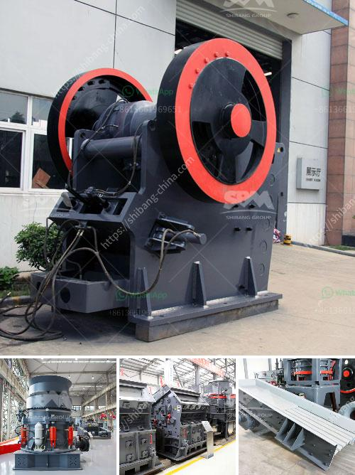

<h3>limestone processes of landscape</h3>
Limestone, a sedimentary rock composed primarily of calcium carbonate, has undergone various processes over millions of years that have shaped and transformed the Earth's landscape. These processes, including deposition, compaction, cementation, and erosion, have given rise to stunning limestone formations and distinctive topography.

Deposition is the first step in the formation of limestone landscapes. When ancient marine organisms such as coral, oysters, and shellfish die, their remains settle on the ocean floor. Over time, layers of their skeletal debris accumulate and harden, forming limestone deposits.

As years pass, the weight of the overlying sediments compresses the underlying layers of limestone, resulting in compaction. This process gradually solidifies the sedimentary material, making it more resistant to erosion and solidifying the limestone rock.

Cementation, the next stage in the limestone formation process, occurs when dissolved minerals infiltrate the sedimentary rocks, filling the gaps between particles and binding them together. This process enhances the strength and durability of the limestone.

Erosion, a natural process driven by wind, water, and ice, gradually wears away the exposed limestone over time. Water, particularly in the form of rain or streams, dissolves the calcium carbonate in the limestone, leading to the creation of unique landforms such as sinkholes, caverns, and underground rivers.

One example of a limestone landscape shaped by these processes is the karst topography found in regions like the Yucatan Peninsula in Mexico or the Guilin region in China. These areas boast an intricate network of sinkholes, underground rivers, and caves formed through erosion of the limestone.

Limestone processes have not only sculpted beautiful landscapes but have also provided significant economic resources. Quarrying limestone for construction materials, agriculture, and cement production has played a pivotal role in human civilization for centuries.

In conclusion, the processes of deposition, compaction, cementation, and erosion have been key contributors to the formation of limestone landscapes. Through these intense geological processes, limestone regions have become renowned for their unique landforms and valuable resources.
<h3>Contact us</h3><ul><li><strong>Whatsapp:&nbsp;<a href="https://wa.me/8613661969651">+8613661969651</a></strong></li><li><a href="https://swt.shibang-china.com/?git&amp;zhl&amp;limestone processes of landscape"><strong>Online Service(chat now)</strong></a></li></ul><h3>Related</h3><ul><li><a href='part of hammer mill.md'>part of hammer mill</a></li><li><a href='gypsum production plant suppliers in pakistan.md'>gypsum production plant suppliers in pakistan</a></li><li><a href='vibrating screens price in south africa.md'>vibrating screens price in south africa</a></li><li><a href='mobile crushers saudi.md'>mobile crushers saudi</a></li><li><a href='what can be produced on hammer crusher.md'>what can be produced on hammer crusher</a></li></ul>