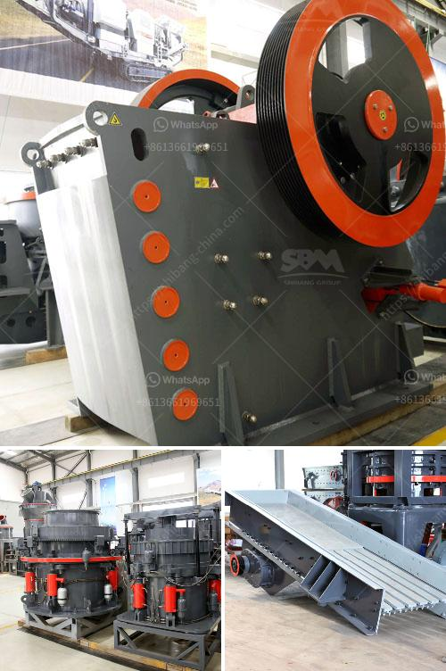

<h3>limestone small crusher machine</h3>
Limestone is a sedimentary rock that is mainly composed of calcite, a mineral form of calcium carbonate (CaCO3). Limestone is widely used in industries such as metallurgy, building materials, chemicals, cement, agriculture, and environmental protection due to its wide application range and relatively low cost.

To process limestone, it is necessary to first crush the bulk of the stone into smaller pieces. This is where a limestone small crusher machine comes in handy. Small limestone crushers are widely used in metallurgy, chemical industry, construction, cement, and other fields. crushing limestone is not only a key step of cement production, but also an important process for the production of high-quality aggregates and other materials.

There are several types of limestone small crusher machines, including jaw crushers, gyratory crushers, impact crushers, and cone crushers. Each has their own pros and cons that need to be considered when choosing a crusher machine for limestone crushing.

Jaw crushers are commonly used as primary crushers, which means they take the initial bulk material and reduce it to a manageable size. They are known for their simple structure, reliable operation, and low operating costs. However, jaw crushers have a lower reduction ratio compared to gyratory and cone crushers.

Gyratory crushers are used for the primary crushing of large limestone materials. They have higher capacity and are capable of producing larger product sizes compared to jaw crushers. However, they are more expensive and require frequent maintenance.

Impact crushers are suitable for processing limestone with a medium hardness. They can produce products with a good particle shape and have a high crushing efficiency. However, impact crushers may generate more fines and have a higher wear rate compared to other crushers.

Cone crushers, like gyratory crushers, are used for secondary crushing of limestone. They have the advantage of producing uniform cubical-shaped particles and high reduction ratios. However, they often require a higher level of maintenance compared to jaw crushers.

In conclusion, a limestone small crusher machine is essential in the limestone crushing process. It can break the large limestone into smaller pieces to ensure the efficient use of resources and improve the overall economic benefits. The choice of a suitable crusher machine should be based on the specific requirements of your project and the desired product size. Whether it is jaw crushers, gyratory crushers, impact crushers, or cone crushers, each type has its own advantages and disadvantages that need to be considered.
<h3>Contact us</h3><ul><li><strong>Whatsapp:&nbsp;<a href="https://wa.me/8613661969651">+8613661969651</a></strong></li><li><a href="https://swt.shibang-china.com/?git&amp;zhl&amp;limestone small crusher machine"><strong>Online Service(chat now)</strong></a></li></ul><h3>Related</h3><ul><li><a href='alluvial gold mining machines.md'>alluvial gold mining machines</a></li><li><a href='philippines crusher equipment.md'>philippines crusher equipment</a></li><li><a href='mobile crushing plant 10x36 cost.md'>mobile crushing plant 10x36 cost</a></li><li><a href='conveyor belts for sale in zambia.md'>conveyor belts for sale in zambia</a></li><li><a href='jaw and cone crusher suppliers in mokopane.md'>jaw and cone crusher suppliers in mokopane</a></li></ul>