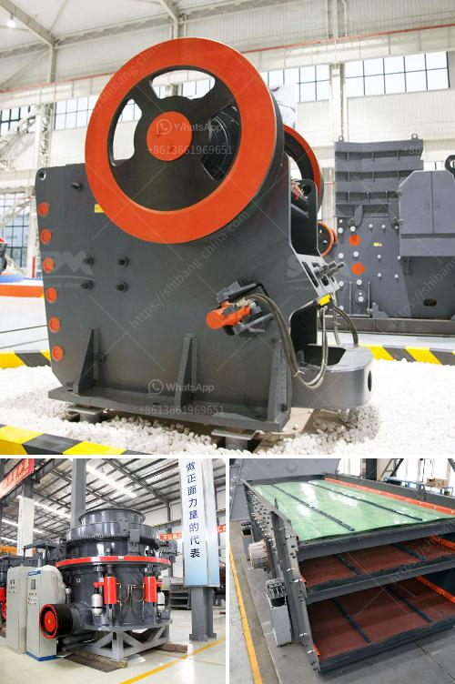

<h3>limestone tons hour machinery</h3>
Limestone is a natural sedimentary rock composed mostly of calcium carbonate (CaCO3) that is formed by the accumulation of shells, coral, and other marine organisms. It has various applications in construction, agriculture, and industry due to its diverse physical and chemical properties.

With the increasing demand for limestone in various sectors, the use of advanced machinery has become essential to extract and process tons of limestone every hour efficiently. The machinery designed for this purpose ensures high productivity, reduced labor, and minimized environmental impact.

One popular machinery used for limestone processing is crushing equipment. These crushing machines are specifically designed to break large limestone rocks into smaller particles of desired size. They work by applying a compressive force on the material, gradually breaking it down into smaller pieces. The crushed limestone is then transported to storage areas or further processed for various applications.

Another critical machinery used for limestone processing is grinding equipment. Grinding machines are used to further reduce the size of limestone particles through mechanical action. They use rotating wheels or disks to grind the limestone into a fine powder. This powder, known as limestone flour or limestone dust, can be used as a filler in various products like paint, rubber, and plastics. Grinding machinery helps increase the surface area of limestone particles, making them more reactive when used in chemical processes.

Conveying equipment is an integral part of limestone processing machinery. It is used to transport limestone from one processing stage to another. Conveyors can be belt conveyors, screw conveyors, or bucket elevators depending on the specific requirements of the processing plant. These machines ensure a smooth and efficient flow of limestone, reducing the chances of clogging or blockage in the production line.

Limestone processing machinery also includes screening equipment. Screening machines are responsible for separating limestone particles of different sizes. They classify the particles into various fractions, allowing easier handling and processing. Screening equipment helps remove unwanted impurities, ensuring that the final product meets the desired quality standards.

In addition to these primary machinery, auxiliary equipment plays a crucial role in limestone processing. Dust collectors are used to control and manage airborne dust particles generated during crushing and grinding operations. They help maintain air quality in the surrounding environment and ensure the safety of the workers. Additionally, vibrating feeders and screens are used to regulate the flow of limestone throughout the production process.

The capacity of limestone machinery in terms of tons per hour depends on various factors, including the hardness of the limestone, the desired final product size, and the specific requirements of the application. Machinery capable of processing tons of limestone every hour is designed to handle large-scale production and meet the demands of the industry.

In conclusion, limestone tons hour machinery is essential in the extraction and processing of limestone. Crushing, grinding, conveying, screening, and auxiliary equipment are used to efficiently process tons of limestone every hour. These machines not only enhance productivity but also ensure the quality and consistency of the limestone product. As the demand for limestone continues to grow, the development of advanced machinery becomes crucial in meeting industry requirements.
<h3>Contact us</h3><ul><li><strong>Whatsapp:&nbsp;<a href="https://wa.me/8613661969651">+8613661969651</a></strong></li><li><a href="https://swt.shibang-china.com/?git&amp;zhl&amp;limestone tons hour machinery"><strong>Online Service(chat now)</strong></a></li></ul><h3>Related</h3><ul><li><a href='cone crusher mobile uk.md'>cone crusher mobile uk</a></li><li><a href='special electrodes for ball mill.md'>special electrodes for ball mill</a></li><li><a href='quarry plant all in one gold mining equipment.md'>quarry plant all in one gold mining equipment</a></li><li><a href='stone crushers in malaysia.md'>stone crushers in malaysia</a></li><li><a href='how to make a vibrating shaft for vibrating screens.md'>how to make a vibrating shaft for vibrating screens</a></li></ul>