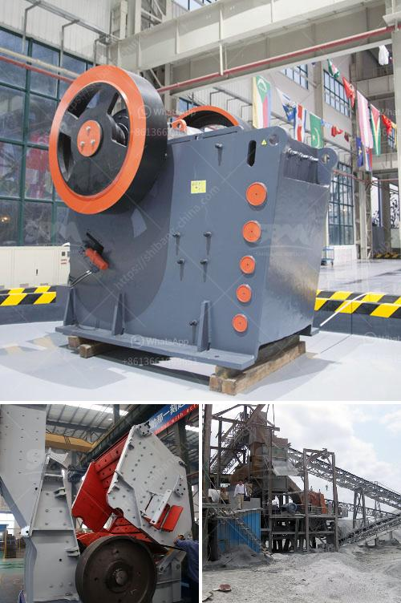

<h3>list iron ore pellet plants in india</h3>
Iron ore pellets are a type of agglomerated ground iron ore fines converted into spherical-shaped balls, which are typically of 6–16 mm in diameter. They are made from low-grade iron ore, and are the primary raw material used in the production of steel. India is one of the largest producers of iron ore pellets in the world, due to its large reserves and abundant supply of high-quality iron ore.

Located at Jamshedpur, Jharkhand, Tata Steel's pellet plant is one of the largest integrated pellet plants in the country. It has a capacity of 10 MTPA and produces both blast furnace grade and direct reduced iron (DRI) grade pellets.

This pellet plant is located in Mangalore, Karnataka. Established in 1987, it has a capacity of 7.5 MTPA and produces high-quality pellets suitable for both captive consumption and export. KIOCL Limited was earlier known as Kudremukh Iron Ore Company Limited and was the largest iron ore mining company in India. The iron ore supply from the Kudremukh mines was halted in 2005 due to environmental concerns, and since then KIOCL has been importing iron ore for pellet production.

Essar Steel operates an 8 MTPA pellet plant in Visakhapatnam, Andhra Pradesh. The plant has a mix of blast furnace and DRI grade pellets, and supplies pellets to Essar Steel's steel plants in Hazira, Gujarat and Paradip, Odisha.

This pellet plant is located at Barbil in the state of Odisha. It has an annual production capacity of 5 MTPA and supplies pellets to various customers, including JSPL's steel plants in Raigad, Chhattisgarh and Angul, Odisha.

Located in Kandra, Jharkhand, this pellet plant has a capacity of 2 MTPA. It supplies pellets to various steel plants in the region.

Situated in Jajpur, Odisha, this pellet plant has a capacity of 4.5 MTPA. It supplies pellets to various steel plants in the state.

This pellet plant is located in Raigarh, Chhattisgarh, and has a capacity of 2 MTPA. It supplies pellets to nearby sponge iron and steel plants.

These are just a few examples of the iron ore pellet plants in India. Several other companies, both private and public, operate pellet plants across the country. The growth of the steel industry in India has led to increased demand for iron ore pellets, resulting in new pellet plants being set up and existing ones expanding their capacities. Iron ore pellets have become crucial in meeting the raw material requirements of the steel industry, and India is well-positioned to cater to this demand with its abundant iron ore resources.
<h3>Contact us</h3><ul><li><strong>Whatsapp:&nbsp;<a href="https://wa.me/8613661969651">+8613661969651</a></strong></li><li><a href="https://swt.shibang-china.com/?git&amp;zhl&amp;list iron ore pellet plants in india"><strong>Online Service(chat now)</strong></a></li></ul><h3>Related</h3><ul><li><a href='200tph vsi crushers.md'>200tph vsi crushers</a></li><li><a href='graphite mine slurry ball mill.md'>graphite mine slurry ball mill</a></li><li><a href='quote for china crusher.md'>quote for china crusher</a></li><li><a href='second stone crusher for sale philippines.md'>second stone crusher for sale philippines</a></li><li><a href='ethiopia gypsum machinery supplier.md'>ethiopia gypsum machinery supplier</a></li></ul>