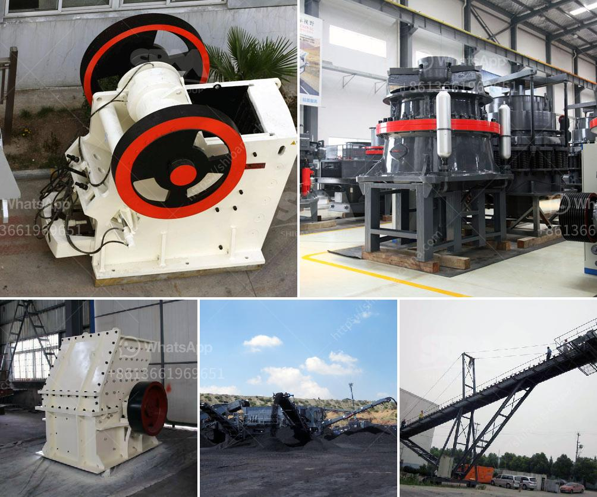

<h3>list of equipments needed to start gold mining</h3>
If you are considering venturing into the world of gold mining, it is essential to have the right equipment to get started. While gold mining can be a lucrative endeavor, it requires some specialized tools to ensure efficient and successful extraction. Here is a list of equipment needed to start gold mining:

1. Gold Pan: A gold pan is a basic and essential tool for any aspiring gold miner. It allows you to separate the lighter material from the heavier gold particles using water and gravity. This simple tool is inexpensive and easy to use, making it a must-have in your mining journey.

2. Sluice Box: A sluice box is a long, narrow box with riffles or obstructions that allow water to flow over them. It is used to trap heavier gold particles as the water washes away the lighter material. Sluice boxes come in various sizes and designs, but they all serve the same purpose – to maximize gold recovery.

3. Gold Dredge: For more efficient gold extraction, a gold dredge is an essential piece of equipment. A gold dredge is a floating platform equipped with a suction hose and nozzle system that can vacuum up sediment and gravel underwater. It allows you to sift through a large amount of material quickly, increasing your chances of finding gold.

4. Metal Detector: A metal detector is a useful tool to have in your arsenal when searching for gold. It can help you locate gold nuggets or smaller flakes hidden beneath the surface. Modern metal detectors come with advanced features and can be adjusted to specific types of metal, making them valuable for gold hunting.

5. Trommel: A trommel is a rotating cylindrical screen that separates materials based on their size. It is commonly used in gold mining to wash and separate large rocks and gravel from finer sands and gold particles. The trommel is an efficient piece of equipment that helps you process more material in less time.

6. Shovel and Pickaxe: While not technically equipment, a good shovel and pickaxe are indispensable tools for any gold mining operation. They are used for digging, breaking up soil or rock, and moving materials on your mining site.

Starting a gold mining venture can be an exciting and profitable endeavor. However, it is essential to have the right equipment to ensure your success. Remember to conduct thorough research, obtain any necessary permits, and invest in the appropriate tools listed above. With dedication, perseverance, and a little bit of luck, you could be well on your way to finding your own gold treasures.
<h3>Contact us</h3><ul><li><strong>Whatsapp:&nbsp;<a href="https://wa.me/8613661969651">+8613661969651</a></strong></li><li><a href="https://swt.shibang-china.com/?git&amp;zhl&amp;list of equipments needed to start gold mining"><strong>Online Service(chat now)</strong></a></li></ul><h3>Related</h3><ul><li><a href='price of zenith stone crusher.md'>price of zenith stone crusher</a></li><li><a href='stone crusher machine pakistan.md'>stone crusher machine pakistan</a></li><li><a href='dolomite powder mill.md'>dolomite powder mill</a></li><li><a href='mobile crushing plant 10x36 cost.md'>mobile crushing plant 10x36 cost</a></li><li><a href='crushing machines for ceramic.md'>crushing machines for ceramic</a></li></ul>