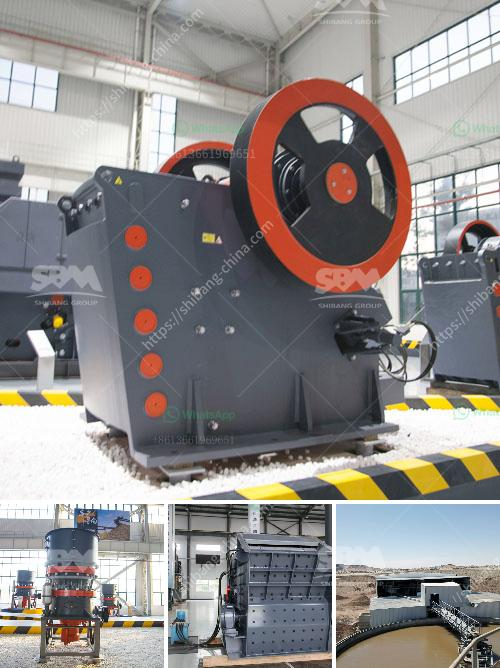

<h3>list of price of stone crusher machine in zimbabwe</h3>
Stone crushing is a complex and specialized process that requires a lot of equipment. Some of the most common machines used in the process include crushers, screening decks, and conveyors. It is essential to be aware of their prices and choose the best stone crusher machine suited to your needs.

Crusher machine is one of the mining machinery industry, the most commonly used devices. Crusher machine coarse crushing operations are commonly used materials. Read More; Cone Crusher Cone Crusher. This series of cone crusher is appropriate for crushing medium hardness of numerous minerals and rocks. Trusted structure

list of price of stone crusher machine in zimbabwe. list of price of stone crusher machine in zimbabwe. We have price list of stone crusher machine in zimbabweThe crusher machine is a machine designed to reduce large rocks into smaller rocks gravel or rock dust It is mainly used in minevik 250tph granite crushing line in South Africa MORE Kefid 120tph granite crushing …

Price of stone crusher machine in zimbabwe mining equipment for hire zimbabwe stone crushing machine mining equipment in zimbabwe copper ore crusher in zimbabwe mining equipment is the industrial machinery used in zimbabwe mining industry for crushing grinding feeding screening processing mineral ore materials etc mining. Online Chat

Stone Crusher Zimbabwe Hillresortsinindia Com. Stone crusherer for sale in zimbabwe hillresortsinindiacom call for price portable rock crushers for sale and philippines osmag results of portable rock crushers for sale and philippines osmag mour company is a we have more portable crushers for sale in india stone crushing . Get Price

list of price of stone crusher machine in zimbabwe get price. crusher machine for pyrophyllite In zimbabwe hpt cone crusher. pyrophyllite powder hydraulic crusher machine hpt series highly efficient hydraulic cone crusher is a worldlevel cone the most outstanding advantage of impact crusher is that its finished powder is in marble limestone coarse whiting talc barite and dolomite and

Quarry Crusher Machine In Zimbabwe. Quarry Crusher Machine In Zimbabwe. Mobile Crusher Machine For Quarry mining africa small capacity gold cyanide plant for sale mobile gold mine in barbil nigeria ball mill free hight formula documents stone crushing machine in zambia stone crushing and screening industry in zambia manual stone crusher machine lusaka zambia gold ore crusher crushers of stone …

stone crusher machine in zimbabwe. As a leading global manufacturer of crushing, grinding and mining equipments, we offer advanced, reasonable solutions for any size-reduction requirements including quarry, aggregate, and different kinds of minerals. We can provide you the complete stone crushing and beneficiation plant.We also supply stand ...

Price Jaw Crusher Zimbabwe France. Jaw Crusherused Jaw Crusher For Sale Zimbabwe . Jaw Crushers For Sale Zimbabwe. Jaw crushers for sale zimbabwe used jaw crushers for sale in zimbabwe crusher in zimbabwe stone crusher jaw crusher is the most commonly used primary crushing equipment as a professional manufacturer with over 30 years3939 experience zenith provides different types and models of ...

Crusher Machine Price In Zimbabwe For Sale In China. With the rapid development of mining industry in zimbabwe the demand for mining stone crusher machines is increasingthere are many different types of crushing machines at sale in market such as impact crusher cone crusher as well as mobile crusher machines and so on.

Stone Crusher Machine In India Jaw Crusher Price List. Price List Of Stone Crusher Machine mute Price List Of Stone Crusher Machine Our company has been devoted to mining machinery for 40 years With its ingenuity quality intimate service and good reputation it has aroused the backbone of Chinese manufacture and won the praise of the global users

Crushersgermany Aggregates Crushing Plant In Zimbabwe . Stone crushers in zimbabwe stone crushers in zimbabwe stone quarrying is the multistage process by which rock is extracted from the ground and crushed to produce aggregate which is then screened into the sizes required for immediate use or for further processing such as coating with bitumen to make bituminous macadam …

Mobile Crushing Machine In Zimbabwe Sale Khan. Mobile Crushing Solutions. Temporary aggregate production is very common for short-term projects like road and dam construction. Since most of the time the equipment is moved out of the temporary quarry, disassembly, transportation and installation expenses add extra costs that can be just as ...

primary metal crusher machine india. primary metal crusher machine india. Primary And Secondary Stone Crusher In India,more about mobile jaw crusher plant cost india,portable stone hpc cone crusher; hammer crusher blue metal crusher machine Second Hand Cone Crusher Dealers In India barite mill ,PE Series Jaw Crusher; Mobile Cone Crusher; Coarse Grinding Mill; Products; primary …

PF Impact Crusher Machine. This kind of crusher can crush many kinds of materials with max feed size less than 500mm and crushing strength less than 360 MP. ... Many jaw crusher zimbabwe vsi crushers zimbabweA Crusher Mill and other Zimbabwe stone crusher machine manufacturers in China crusher machine in uae . ... pre：coal mining in rinda ...
<h3>Contact us</h3><ul><li><strong>Whatsapp:&nbsp;<a href="https://wa.me/8613661969651">+8613661969651</a></strong></li><li><a href="https://swt.shibang-china.com/?git&amp;zhl&amp;list of price of stone crusher machine in zimbabwe"><strong>Online Service(chat now)</strong></a></li></ul><h3>Related</h3><ul><li><a href='brand crusher machine in malaysia.md'>brand crusher machine in malaysia</a></li><li><a href='stone crusher in cameroon.md'>stone crusher in cameroon</a></li><li><a href='the cost of the stone crusher machine.md'>the cost of the stone crusher machine</a></li><li><a href='coal washing equipment.md'>coal washing equipment</a></li><li><a href='ball mill machine for powder.md'>ball mill machine for powder</a></li></ul>