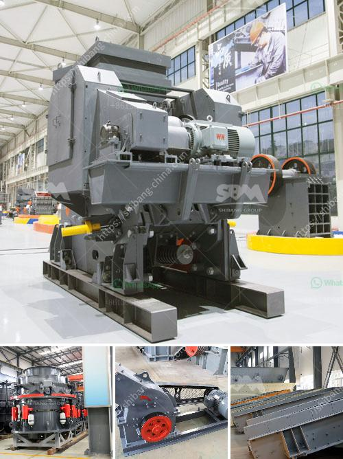

<h3>list of quarry crusher company in the philippines</h3>
1. Baker Rock Resources - With four quarries strategically located across the Philippines, Baker Rock Resources has been a leading supplier of crushed rock, sand, and gravel for construction projects in the region. They offer a wide variety of materials for road and building construction, including limestone, sandstone, and granite.

2. Euroasia Marble and Granite Inc. - Specializing in the extraction, processing, and distribution of natural stone products, Euroasia Marble and Granite Inc. operates several quarries in the Philippines. They offer a range of materials, including marble, granite, limestone, sandstone, and travertine, which are used in various construction applications.

3. Solid Group Inc. - Established in 1963, Solid Group Inc. is one of the largest quarrying companies in the Philippines. They operate several quarries in Luzon, Visayas, and Mindanao, offering a wide range of aggregates for construction projects. Their main products include crushed rock, gravel, sand, and quarry dust.

4. Apo Land and Quarry Corp. - Established in 2002, Apo Land and Quarry Corp. (ALQC) is a subsidiary of the CEMEX Holdings Philippines (CHP) group. They operate a crushing plant located in Naga, Cebu, which produces crushed aggregates for the construction industry. ALQC supplies products to major infrastructure and property developers in the region.

5. Montalban Millex Aggregates Corp. - Montalban Millex Aggregates Corp. (MMAC) is a quarrying company located in Rodriguez, Rizal. They are known for supplying high-quality aggregates used in the construction of roads and buildings. MMAC's quarrying operations are supported by a modern crushing plant that ensures consistent product quality.

6. Holcim Philippines - Holcim Philippines is one of the leading construction material companies in the country. They operate several quarries that produce a wide range of aggregates, including crushed rock, gravel, and sand. Holcim's products are used in various infrastructure projects, such as roads, bridges, and buildings.

7. Cemex Philippines - Cemex Philippines is a subsidiary of CEMEX S.A.B. de C.V., a global leader in the building materials industry. They operate several quarries and cement plants in the Philippines, supplying high-quality aggregates and cement products for construction projects. Their quarrying operations are backed by modern crushing and screening equipment.

8. Republic Cement - Republic Cement is a leading producer of cement and aggregates in the Philippines. They operate several limestone quarries and crushing plants in Luzon, Visayas, and Mindanao. Republic Cement's products are used in various construction applications, including infrastructure projects, residential buildings, and commercial developments.

These are just a few of the quarry crusher companies in the Philippines. With the country's growing infrastructure needs, there is significant demand for aggregates for construction projects. These companies play a crucial role in supplying high-quality materials that are essential for the development of roads, buildings, and other infrastructure.
<h3>Contact us</h3><ul><li><strong>Whatsapp:&nbsp;<a href="https://wa.me/8613661969651">+8613661969651</a></strong></li><li><a href="https://swt.shibang-china.com/?git&amp;zhl&amp;list of quarry crusher company in the philippines"><strong>Online Service(chat now)</strong></a></li></ul><h3>Related</h3><ul><li><a href='lime dolomite plant processing.md'>lime dolomite plant processing</a></li><li><a href='crusher for sale in dubai.md'>crusher for sale in dubai</a></li><li><a href='stne crusher for sale south africa.md'>stne crusher for sale south africa</a></li><li><a href='vertical cement mill grinding plant.md'>vertical cement mill grinding plant</a></li><li><a href='list of equipments needed to start gold mining.md'>list of equipments needed to start gold mining</a></li></ul>