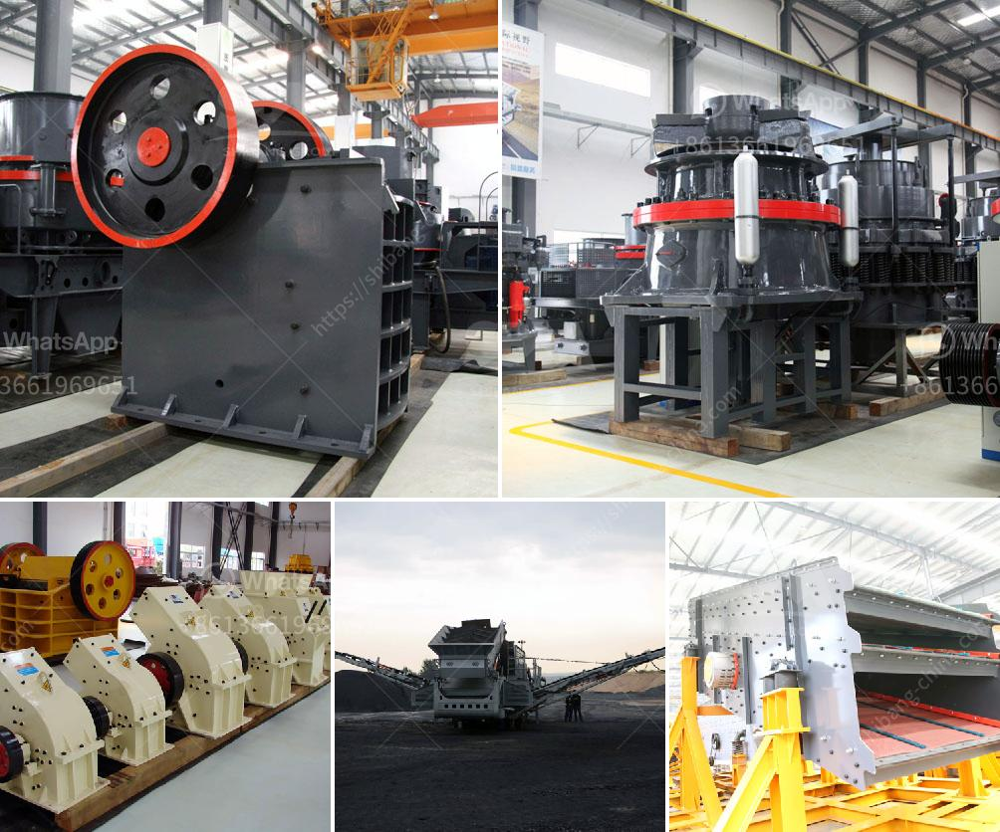

<h3>list of sponge iron factories in hospet</h3>
Hospet, located in the Bellary district of Karnataka, India, is home to several sponge iron factories. Sponge iron, also known as direct-reduced iron (DRI), is a highly purified form of iron ore that is created by reducing iron ore in a furnace at a high temperature. This process eliminates impurities and provides a concentrated form of iron ready for use in various industries.

1. JSW Steel Limited: JSW Steel, one of India's leading steel companies, operates a sponge iron factory in Hospet. The plant has a state-of-the-art rotary kiln, which is used for the production of sponge iron.

2. BMM Ispat Limited: BMM Ispat owns and operates a sponge iron factory in Hospet. The company is known for its commitment to sustainable production practices and has implemented several eco-friendly initiatives at its plant.

3. Kalyani Steels Limited: Kalyani Steels is a renowned steel manufacturing company that also has a sponge iron factory in Hospet. The factory produces high-quality sponge iron that is used by various industries, including automotive and construction.

4. SLR Metaliks Limited: SLR Metaliks operates a sponge iron factory near Hospet. The company is known for its dedication to quality and has implemented stringent quality control measures at its plant.

5. BMM Ispat Limited - Danapuram Iron Ore Mines: BMM Ispat's Danapuram Iron Ore Mines, located near Hospet, contribute to the raw material requirements of its sponge iron factory. These mines ensure a steady supply of iron ore for the production of sponge iron.

It is worth noting that these are just a few examples of the sponge iron factories in Hospet. The region's rich iron ore reserves and favorable industrial infrastructure have attracted several companies to establish sponge iron production facilities in the area.

The presence of these factories not only contributes to the economic growth of Hospet but also provides employment opportunities for the local population. Furthermore, the production of sponge iron in Hospet plays a crucial role in meeting the demand for this essential raw material in various industries across India.

In conclusion, Hospet is home to several sponge iron factories, including those operated by JSW Steel Limited, BMM Ispat Limited, Kalyani Steels Limited, and SLR Metaliks Limited. These factories contribute significantly to the production of sponge iron, a vital component in various industries. The presence of these factories not only boosts the local economy but also provides employment opportunities for the residents of Hospet.
<h3>Contact us</h3><ul><li><strong>Whatsapp:&nbsp;<a href="https://wa.me/8613661969651">+8613661969651</a></strong></li><li><a href="https://swt.shibang-china.com/?git&amp;zhl&amp;list of sponge iron factories in hospet"><strong>Online Service(chat now)</strong></a></li></ul><h3>Related</h3><ul><li><a href='to buy medium mounted stone crusher in uk.md'>to buy medium mounted stone crusher in uk</a></li><li><a href='100tph wet grinding mill.md'>100tph wet grinding mill</a></li><li><a href='used jaw mobile crusher in uae.md'>used jaw mobile crusher in uae</a></li><li><a href='conveyor belt equipment for mining south africa.md'>conveyor belt equipment for mining south africa</a></li><li><a href='price and sales of quarry crusher in nigeria.md'>price and sales of quarry crusher in nigeria</a></li></ul>