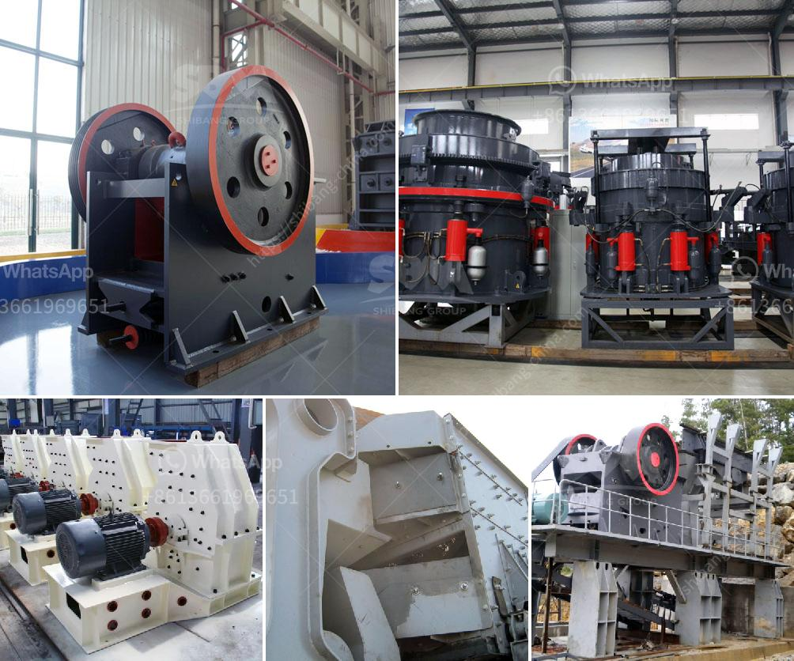

<h3>low cost jaw crusher price</h3>
A jaw crusher is a necessary tool for mining and ore processing industries. Jaw crushers are widely used in the mining industry as well as the construction industry. These efficient machines have gained immense popularity in recent years due to their ability to crush materials of any hardness and size.

One of the main reasons why jaw crushers are preferred over other crushing machines is their low cost. Jaw crushers are relatively cheaper than other types of stone crushers, making them an ideal choice for businesses on a budget. The price of a jaw crusher depends on several factors, such as the size of the machine, the capacity, and the features it offers.

A small jaw crusher with a capacity of 1-3 tons per hour is priced at around $18,000-$55,000. Larger jaw crushers with capacities up to 300 tons per hour can cost around $60,000-$75,000. It is important to consider several factors before purchasing a jaw crusher. These factors include the type of material to be crushed, the desired capacity, and the final product size requirement.

In addition to the initial purchase cost, maintenance and operating costs should also be considered. It is advisable to choose a jaw crusher that offers low maintenance requirements and high efficiency to minimize operating costs. Some jaw crushers are equipped with advanced features such as hydraulic adjustment systems, automatic lubrication systems, and overload protection. These features not only improve the efficiency of the machine but also reduce maintenance requirements, increasing the lifespan of the equipment.

Overall, a low-cost jaw crusher offers an affordable solution for businesses that require crushing machines for their operations. With their ability to efficiently crush materials, low initial investment, and reduced maintenance costs, jaw crushers are an attractive option for businesses on a tight budget. However, it is important to choose a reliable supplier and ensure that the machine is suitable for the specific requirements of the application to achieve the desired results efficiently and cost-effectively.
<h3>Contact us</h3><ul><li><strong>Whatsapp:&nbsp;<a href="https://wa.me/8613661969651">+8613661969651</a></strong></li><li><a href="https://swt.shibang-china.com/?git&amp;zhl&amp;low cost jaw crusher price"><strong>Online Service(chat now)</strong></a></li></ul><h3>Related</h3><ul><li><a href='production process clinker zurich switzerland.md'>production process clinker zurich switzerland</a></li><li><a href='pulverizer crusher machine for coal.md'>pulverizer crusher machine for coal</a></li><li><a href='work principle of a hammer mill.md'>work principle of a hammer mill</a></li><li><a href='ball mill for limestone.md'>ball mill for limestone</a></li><li><a href='mobile crusher tanzania.md'>mobile crusher tanzania</a></li></ul>