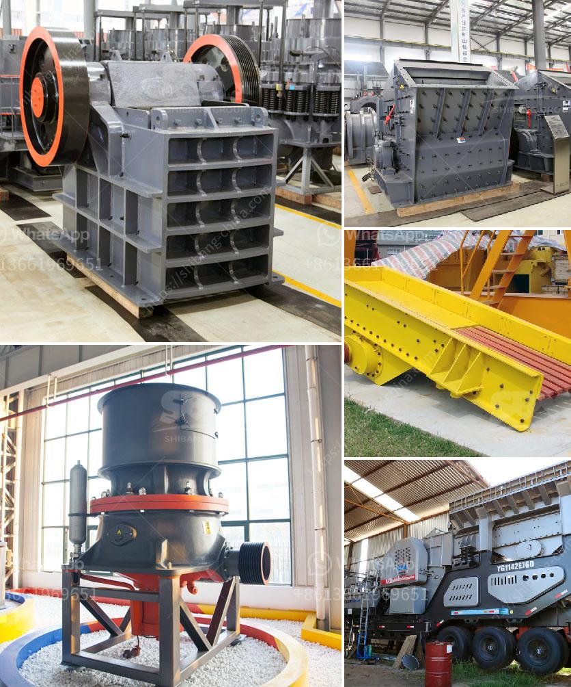

<h3>low cost roller mill suppliers india</h3>
Low-cost roller mill suppliers in India have been instrumental in revolutionizing the agricultural industry. These rollers mills are widely used in the processing of various grains such as corn, wheat, and barley, as well as other crops like rice and millet. The main advantage of these roller mills is that they offer a cost-effective solution for farmers, enabling them to process their produce efficiently and economically.

One of the leading low-cost roller mill suppliers in India is ABC Machinery. With their state-of-the-art manufacturing facility and a team of experienced engineers, ABC Machinery has been providing farmers with high-quality roller mills at affordable prices. These roller mills are designed to deliver consistent and uniform grinding, ensuring optimal particle size and enhanced nutrition in the processed grains.

Another prominent supplier in the Indian market is Ludhiana Engineering Works. They specialize in manufacturing roller mills that are suitable for a wide range of agricultural applications. Ludhiana Engineering Works offers roller mills in different capacities to meet the diverse needs of farmers. With their robust construction and easy-to-use functionality, these roller mills have gained popularity among farmers across India.

Apart from these suppliers, there are several other local manufacturers who cater to the demand for low-cost roller mills in India. These manufacturers are committed to providing affordable yet efficient solutions to the farming community. With their expertise and dedication, they have contributed significantly to the growth of the agricultural sector in India.

Low-cost roller mill suppliers have significantly improved the productivity and profitability of farmers in India. These roller mills have enabled farmers to process their crops more efficiently, resulting in higher yields and better quality produce. Additionally, the affordability of these roller mills has made them accessible to a wider range of farmers, including small-scale and marginalized farmers.

In conclusion, low-cost roller mill suppliers in India have played a vital role in transforming the agricultural industry. Their cost-effective solutions have empowered farmers to process their produce efficiently and economically. With their contributions, these suppliers have improved the livelihoods of farmers and contributed to the overall growth of the agricultural sector in India.
<h3>Contact us</h3><ul><li><strong>Whatsapp:&nbsp;<a href="https://wa.me/8613661969651">+8613661969651</a></strong></li><li><a href="https://swt.shibang-china.com/?git&amp;zhl&amp;low cost roller mill suppliers india"><strong>Online Service(chat now)</strong></a></li></ul><h3>Related</h3><ul><li><a href='used portable crushing plant for sale philippines.md'>used portable crushing plant for sale philippines</a></li><li><a href='harga mobile stone crusher surabaya.md'>harga mobile stone crusher surabaya</a></li><li><a href='feldspar ball mill in kenya.md'>feldspar ball mill in kenya</a></li><li><a href='stone crushing machine for sale.md'>stone crushing machine for sale</a></li><li><a href='crusher machine plant.md'>crusher machine plant</a></li></ul>