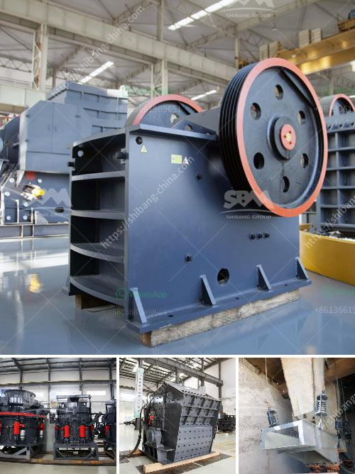

<h3>low productivity jaw crusher</h3>
The low productivity jaw crusher is widely used in mining, building materials, chemical industry, metallurgy and other industries. It is a common rough crushing equipment. However, due to its large size and high process capacity, it is not suitable for small and medium-sized investors. Therefore, how to improve the productivity and working efficiency of low productivity jaw crushers has become a major concern for many users.

Firstly, the improper operation of the jaw crusher will affect the productivity of the equipment. During the operation of the crusher, the operator should strictly follow the operating procedures and operate the equipment according to the specified methods. For example, the feeding should be even and continuous, and the materials should not be overloaded to avoid clogging the crushing chamber. Pay attention to the current and voltage of the crusher motor, and stop the machine for inspection in case of abnormal conditions.

Secondly, the selection of jaw crusher models also affects the productivity. Different models have different processing capacity, power consumption, and size requirements for materials. Before purchasing the equipment, users should make a comprehensive analysis of their own production needs and choose a suitable model of the jaw crusher. It is not advisable to blindly pursue the large-scale and high-power models, as it will not only increase the investment cost but also reduce the productivity and economic benefits.

Thirdly, the quality of jaw crusher plays a vital role in its productivity. A high-quality and reliable jaw crusher can greatly improve the productivity and extend the service life of the equipment. Therefore, when selecting the crusher, users should not only consider the price factor but also pay attention to the quality and performance of the equipment. It is recommended to choose well-known manufacturers with mature technology and good reputation to ensure the quality and after-sales service of the equipment.

Lastly, regular maintenance and repair of the jaw crusher are essential for improving its productivity. The operators should regularly check and maintain the equipment, and promptly repair and replace the worn and damaged parts. Regular lubrication of the jaw crusher can reduce the friction between the parts and improve the working efficiency. In addition, regular inspection of the jaw crusher can effectively prevent the occurrence of failures and ensure the normal operation of the equipment.

In conclusion, the low productivity of jaw crushers can be improved by implementing proper operation, selecting suitable models, choosing high-quality equipment, and conducting regular maintenance and repair. By paying attention to these aspects, users can effectively increase the productivity and working efficiency of the jaw crusher, and achieve higher economic benefits.
<h3>Contact us</h3><ul><li><strong>Whatsapp:&nbsp;<a href="https://wa.me/8613661969651">+8613661969651</a></strong></li><li><a href="https://swt.shibang-china.com/?git&amp;zhl&amp;low productivity jaw crusher"><strong>Online Service(chat now)</strong></a></li></ul><h3>Related</h3><ul><li><a href='slag crushing machine hopper in india.md'>slag crushing machine hopper in india</a></li><li><a href='used crusher plant in uae.md'>used crusher plant in uae</a></li><li><a href='continuous ball mill capacity 500 hr.md'>continuous ball mill capacity 500 hr</a></li><li><a href='decibels declined jaw crusher hebro.md'>decibels declined jaw crusher hebro</a></li><li><a href='quartz grits plant consultancy.md'>quartz grits plant consultancy</a></li></ul>