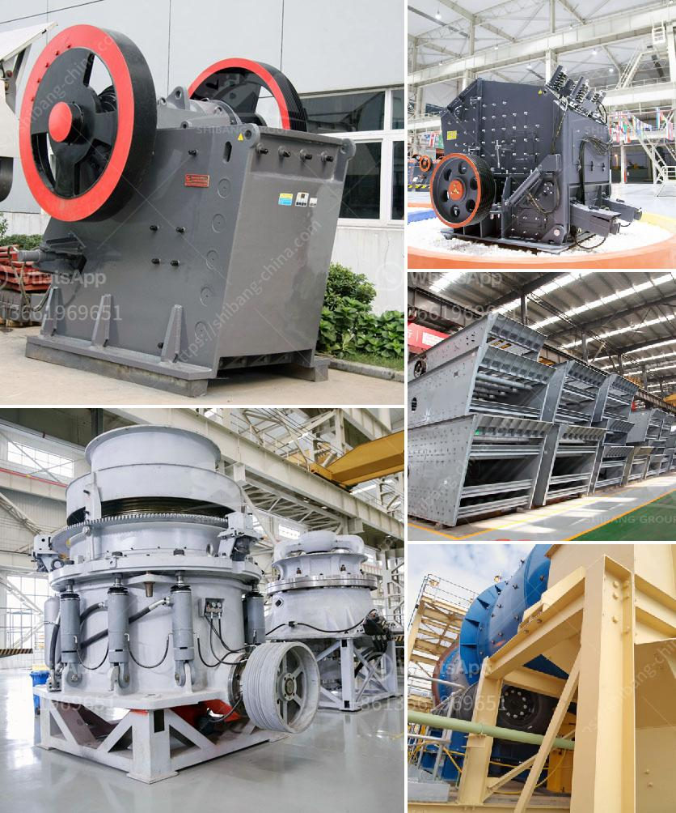

<h3>machine for limestone river gravel stone</h3>
When it comes to constructing buildings, roads, dams, or even just landscaping your backyard, the choice of materials is crucial. The durability, strength, and aesthetic appeal of the finished product depend heavily on the quality of the materials used. When it comes to natural stones, limestone river gravel stone is often the top choice due to its versatility and durability. However, the process of extracting and processing this stone can be challenging without the right equipment. That's where the machine for limestone river gravel stone comes in.

This specialized machine is designed to efficiently extract and process limestone river gravel stone, making it perfect for large construction projects. Equipped with powerful blades and a robust engine, the machine can easily cut through the toughest limestone river deposits. The extracted stone is then transported via a conveyor belt to a processing unit, where it is sorted, crushed, and graded based on the desired size and quality.

The machine's versatility makes it suitable not only for large-scale projects but also for smaller ones. Whether you need to pave a driveway, construct a walkway, or enhance your garden's landscape, the machine can handle the workload. Its precise cutting abilities ensure that the stone will fit together seamlessly, creating a polished and professional finish.

One of the machine's key advantages is its efficiency. With its speed and power, it can extract and process a large quantity of limestone river gravel stone in a short period. This translates into significant savings in both time and labor costs. By investing in this machine, construction companies and contractors can complete their projects faster, allowing them to take on more jobs and increase their profits.

Lastly, the machine for limestone river gravel stone is designed with safety in mind. It comes with various safety features, such as emergency shut-off switches, protective guards, and advanced monitoring systems to ensure the well-being of the operators and bystanders. Additionally, the machine's ergonomic design minimizes strain and fatigue, promoting a safer and more comfortable working environment.

In conclusion, the machine for limestone river gravel stone is a game-changer in the construction industry. Its efficiency, versatility, and safety features make it an indispensable tool for any construction project involving limestone river gravel stone. Whether you're building a skyscraper or designing a backyard oasis, investing in this machine will undoubtedly result in a superior and more cost-effective outcome. So, why settle for anything less than excellence? Choose the machine for limestone river gravel stone and transform your construction plans into a reality.
<h3>Contact us</h3><ul><li><strong>Whatsapp:&nbsp;<a href="https://wa.me/8613661969651">+8613661969651</a></strong></li><li><a href="https://swt.shibang-china.com/?git&amp;zhl&amp;machine for limestone river gravel stone"><strong>Online Service(chat now)</strong></a></li></ul><h3>Related</h3><ul><li><a href='used basalt stone jaw crusher for sale.md'>used basalt stone jaw crusher for sale</a></li><li><a href='vertical roller mill in taiwan.md'>vertical roller mill in taiwan</a></li><li><a href='spare parts for raymond mill.md'>spare parts for raymond mill</a></li><li><a href='jaw bone crusher made in britain.md'>jaw bone crusher made in britain</a></li><li><a href='gold hammer mill suppliers in dubai.md'>gold hammer mill suppliers in dubai</a></li></ul>