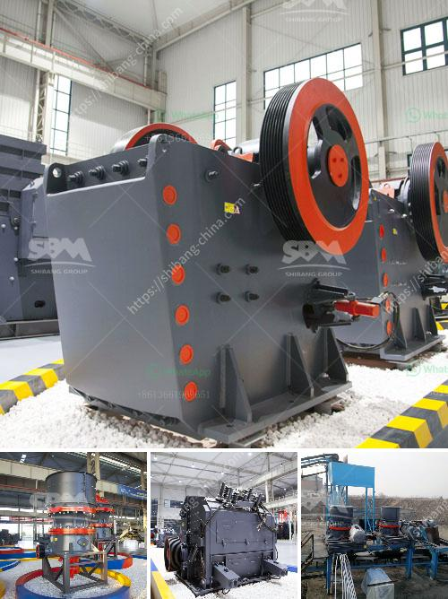

<h3>machinery for talc manufacturing</h3>
Talc is a versatile mineral that is widely utilized across various industries. Its unique properties, such as resistance to heat, electricity, and chemicals, make it an essential ingredient in numerous products. From cosmetics and baby powders to ceramics and paints, talc plays a crucial role in enhancing the quality and functionality of these items. In order to meet the growing demand for talc products, manufacturers rely on advanced machinery to streamline the production process.

One of the key steps in talc manufacturing involves the extraction and sorting of raw talc rocks from the mines. This process often requires heavy machinery to efficiently excavate and transport the talc rocks to the manufacturing facility. Bulldozers, excavators, and dump trucks are commonly used in this stage to ensure a continuous supply of raw materials.

Once the talc rocks reach the manufacturing plant, they undergo extensive processing to convert them into talcum powder or other talc-based products. Cutting-edge machinery plays a vital role in these processing stages, ensuring the production process remains efficient and consistent.

The first step in the manufacturing process involves crushing and grinding the raw talc rocks into fine particles. Crushers and pulverizers are key pieces of machinery in this stage, as they break down the rocks into smaller sizes before further processing. This step is crucial in achieving the desired particle size and morphology of the final talc product.

After size reduction, the talc particles are often subjected to various beneficiation techniques. These techniques aim to remove impurities and enhance the talc's purity and quality. Machinery such as screens, classifiers, and magnetic separators are commonly used in this stage to efficiently separate impurities from the talc particles. These machines are precision-engineered to ensure accurate separation and maximize the recovery of high-quality talc.

Once the talc particles are purified, they are often subjected to additional processes to modify their properties as per specific requirements. Surface treatments, coatings, and micronization are some of the common processes carried out using specialized machinery. These processes help to enhance the talc's functionality, improve its dispersibility, and achieve the desired particle size distribution.

In recent years, the industry has witnessed the integration of automation and computerized systems into the talc manufacturing process. This integration has led to increased efficiency, reduced labor requirements, and improved product quality. Automated machinery now controls various stages of the manufacturing process, ensuring precise control over particle size, purity, and overall product consistency.

Furthermore, advancements in machinery have also enabled manufacturers to adopt eco-friendly practices. Machinery equipped with energy-efficient features and waste management systems helps to minimize the environmental impact of talc manufacturing. This aligns with the growing global focus on sustainable manufacturing practices.

In conclusion, machinery plays a critical role in the manufacturing of talc. From the initial extraction and sorting of raw materials to the final processing stages, advanced machinery enhances efficiency and ensures consistent quality. The integration of automation and eco-friendly features has further revolutionized talc manufacturing, enabling manufacturers to meet the increasing demand for talc-based products while minimizing environmental impact.
<h3>Contact us</h3><ul><li><strong>Whatsapp:&nbsp;<a href="https://wa.me/8613661969651">+8613661969651</a></strong></li><li><a href="https://swt.shibang-china.com/?git&amp;zhl&amp;machinery for talc manufacturing"><strong>Online Service(chat now)</strong></a></li></ul><h3>Related</h3><ul><li><a href='vertical roller mill.md'>vertical roller mill</a></li><li><a href='iron crusher in mexico.md'>iron crusher in mexico</a></li><li><a href='ball mill in aluminum plant equipments.md'>ball mill in aluminum plant equipments</a></li><li><a href='coal crusher machine in south africa.md'>coal crusher machine in south africa</a></li><li><a href='sand making machine manufacturers.md'>sand making machine manufacturers</a></li></ul>