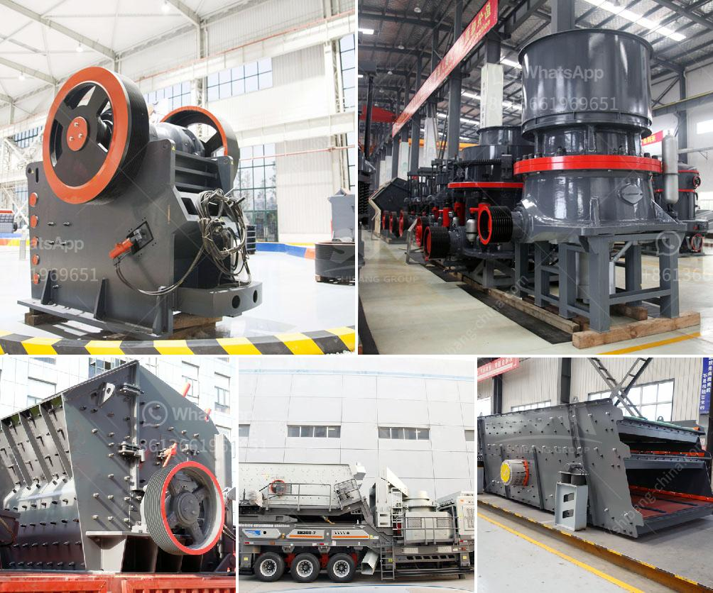

<h3>machinery used in making dolomite powder</h3>
Dolomite powder, also known as dolomite limestone powder, is a sedimentary rock composed of calcium carbonate and magnesium carbonate. The high magnesium content present in dolomite powder makes it an ideal raw material for producing magnesium metal and other magnesium-based products, as well as a key ingredient in the production of glass, ceramics, and fertilizers.

The process of manufacturing dolomite powder involves crushing the large dolomite rocks into smaller particles and then milling them into a fine powder. This powder form is commonly used as a filler material in various industries due to its excellent properties such as high brightness, good dispersibility, and chemical inertness.

To produce dolomite powder efficiently and effectively, various types of machinery are used throughout the manufacturing process. Let's discuss some of the key machinery used in making dolomite powder:

1. Jaw Crusher: The first step in the dolomite powder production process is the crushing of dolomite rocks by a jaw crusher. This machine is designed to break large-sized rocks into smaller pieces, which are then sent to the mill for further processing.

2. Hammer Mill: After the initial crushing stage, the dolomite rocks are further reduced in size by a hammer mill. This machine consists of a rotating drum with hammers that strike and crush the dolomite particles. The crushed material is then classified and separated based on their size.

3. Raymond Mill: After the pre-processing steps, the dolomite particles are fed into a Raymond mill for grinding. This mill uses rotating rollers to crush, grind, and classify the dolomite powder. It provides high grinding efficiency and produces a fine and uniform powder suitable for various industrial applications.

4. Classifier: The classifier is an essential piece of machinery used in the dolomite powder manufacturing process. It classifies the ground dolomite powder into different size fractions and ensures the quality and uniformity of the final product. The classified dolomite powder is then transported to storage silos or packaging units.

5. Bagging Machine: Once the dolomite powder is ready, it is either stored in silos or directly packed in bags using a bagging machine. This automated machine fills the bags with the desired quantity of dolomite powder and seals them, ready for distribution to the end-users.

6. Dust Collector: Dust generation is a common issue during the dolomite powder manufacturing process. To minimize dust emission and maintain a clean and healthy working environment, dust collectors are used. These machines capture and remove airborne particles, ensuring the safety of workers and preventing pollution.

In conclusion, the production of dolomite powder involves several stages and the use of specialized machinery to ensure the quality, uniformity, and efficiency of the final product. Each piece of machinery plays a vital role in achieving the desired output. From crushing the raw materials to classifying and packaging the final powder, the machinery involved in making dolomite powder plays a crucial role in meeting the growing demand for this versatile and valuable mineral.
<h3>Contact us</h3><ul><li><strong>Whatsapp:&nbsp;<a href="https://wa.me/8613661969651">+8613661969651</a></strong></li><li><a href="https://swt.shibang-china.com/?git&amp;zhl&amp;machinery used in making dolomite powder"><strong>Online Service(chat now)</strong></a></li></ul><h3>Related</h3><ul><li><a href='vertical roller mill manufacture in tamilnadu.md'>vertical roller mill manufacture in tamilnadu</a></li><li><a href='how much does it cost to build a slag processing plant.md'>how much does it cost to build a slag processing plant</a></li><li><a href='limestone grinding mill unit.md'>limestone grinding mill unit</a></li><li><a href='price of mobile crusher.md'>price of mobile crusher</a></li><li><a href='made in germany stone crusher.md'>made in germany stone crusher</a></li></ul>