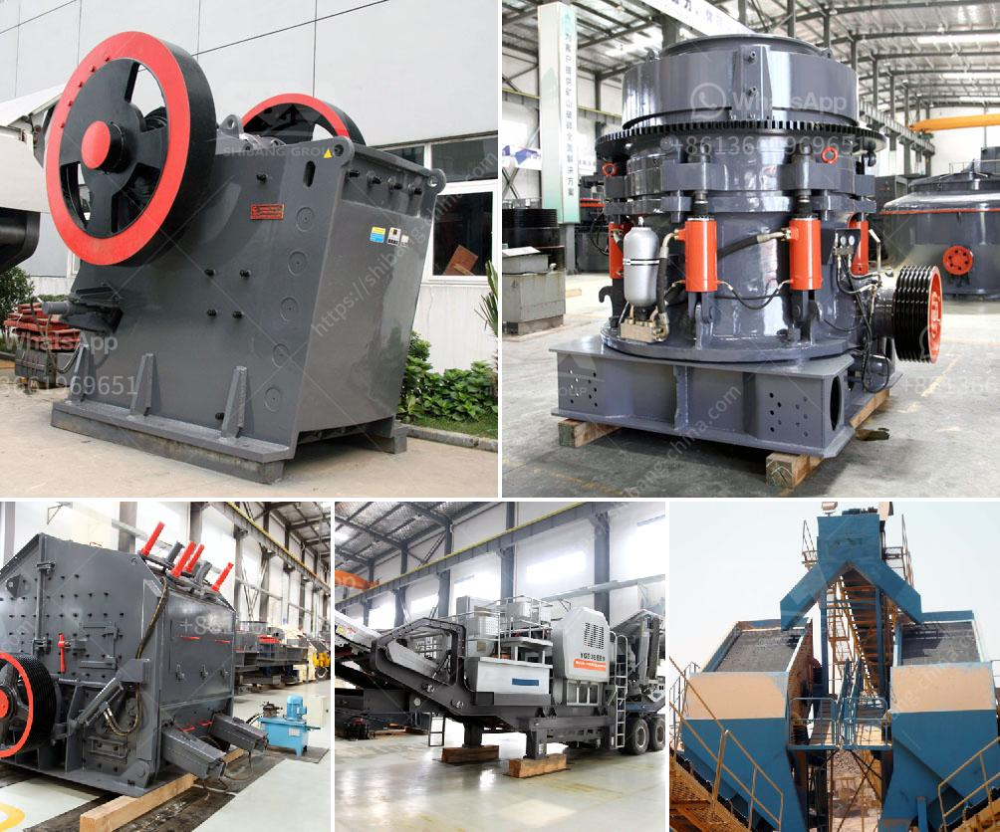

<h3>machines used for cement manufacturing</h3>
In the construction industry, cement is a crucial element for the creation of durable infrastructure. It is the primary binding agent that holds materials together, forming concrete. Cement manufacturing involves several complex processes and requires various machines and equipment for efficient and reliable production.

One of the key machines used in cement manufacturing is kiln equipment. Kilns are responsible for the heating of raw materials to a specific temperature, transforming them chemically into cement clinker. This process, known as calcination, requires precise control and consistent heating. Typically, kilns are rotary or vertical in nature and can reach extremely high temperatures, ranging from 1400 to 1500 degrees Celsius. Continuous monitoring systems and automated controls are used to ensure optimal performance and energy efficiency.

Raw material preparation is another critical step in cement manufacturing. This process involves quarried limestone, clay, and other materials being crushed, ground, and homogenized into a fine powder. Several machines are employed in this phase, including crushers, ball mills, roller press, and vertical mills. Each of these machines works collaboratively to reduce the size of the raw materials, ensuring their proper chemical composition.

Cement milling is the next stage in the manufacturing process, where the clinker is ground with additives such as gypsum to form the final cement product. This process is typically aided by ball mills and vertical roller mills, which grind the clinker to specific fineness requirements. These mills are driven by electric motors and their operation is carefully regulated to optimize energy consumption while maintaining cement quality. Modern mills are equipped with advanced control systems to achieve better performance and automation.

Another vital machine in cement manufacturing is the bagging machine. After the final cement product is produced, it needs to be packaged for storage or transportation. Bagging machines automate the filling, weighing, and sealing of cement into bags of various sizes. These machines ensure accurate measurement of cement quantity and reduce manual labor, thereby increasing productivity and minimizing errors.

Furthermore, in cement manufacturing plants, material handling equipment plays a crucial role in moving raw materials, clinker, and finished products. Belt conveyors, bucket elevators, and screw conveyors are commonly used machines in this regard. These machines efficiently transport bulk materials at different stages of the manufacturing process, ensuring a smooth and continuous flow of materials.

Investing in modern and efficient machinery is essential for cement manufacturers to improve productivity, reduce energy consumption, and minimize environmental impact. With the advancements in technology, many manufacturers are now integrating artificial intelligence (AI) and machine learning (ML) into their machinery. These AI-powered systems can monitor and adjust various parameters during the manufacturing process, optimizing performance and minimizing waste.

In conclusion, cement manufacturing relies on a wide range of machines and equipment to transform raw materials into the final product. Kilns, crushers, ball mills, vertical mills, bagging machines, and material handling equipment are some of the key machines used in cement manufacturing. These machines work in synergy to ensure efficient production, maintain quality, and meet the demands of the construction industry. As technology advances, integrating AI and ML into these machines further enhances their performance and sustainability, making cement manufacturing an ever-evolving industry.
<h3>Contact us</h3><ul><li><strong>Whatsapp:&nbsp;<a href="https://wa.me/8613661969651">+8613661969651</a></strong></li><li><a href="https://swt.shibang-china.com/?git&amp;zhl&amp;machines used for cement manufacturing"><strong>Online Service(chat now)</strong></a></li></ul><h3>Related</h3><ul><li><a href='powder mill rollers machine.md'>powder mill rollers machine</a></li><li><a href='stone crusher machine pakistan.md'>stone crusher machine pakistan</a></li><li><a href='stone crusher plant layout.md'>stone crusher plant layout</a></li><li><a href='sand washing machine zenith.md'>sand washing machine zenith</a></li><li><a href='harga sewa beli stone crusher kapasitas 30 ton per jam.md'>harga sewa beli stone crusher kapasitas 30 ton per jam</a></li></ul>