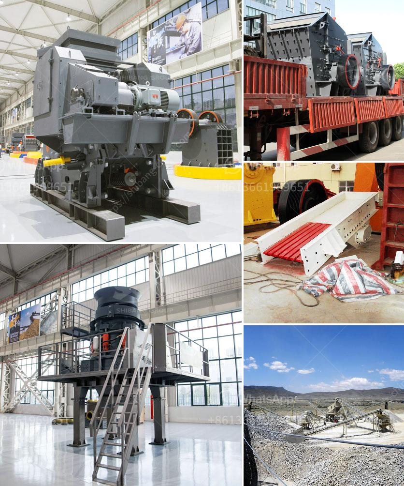

<h3>magnetic separator manufacturers in turkey</h3>
Magnetic separators play a crucial role in various industries, such as mining, food processing, recycling, and manufacturing. These devices are designed to separate unwanted materials from valuable ones, ensuring product quality and preventing damage to machinery. In Turkey, there are several magnetic separator manufacturers who are committed to delivering high-performance and reliable solutions to their customers.

One of the leading magnetic separator manufacturers in Turkey is Bunting Magnetics Co. With over 60 years of experience, they offer a wide range of magnetic separation equipment tailored to meet different industry requirements. Their product portfolio includes magnetic pulleys, plate magnets, magnetic drum separators, and magnetic conveyors. Bunting Magnetics Co. prioritizes the use of strong and durable magnets to ensure efficient and long-lasting separation.

Another reputable manufacturer in Turkey is Gürsan Gençlik Makine Sanayi ve Ticaret A.Ş. They specialize in the production of magnetic separators for the mining and recycling industries. Gürsan Gençlik's magnetic separators can effectively separate ferromagnetic particles from various materials, such as coal, sand, and waste. Their separators are designed to withstand harsh operating conditions, guaranteeing uninterrupted performance.

In addition to Bunting Magnetics Co. and Gürsan Gençlik, Arup Demir Sanayi ve Ticaret Ltd. Şti is also recognized as a prominent magnetic separator manufacturer in Turkey. Their tailored solutions cater to the specific needs of clients in industries such as ceramics, glass, and chemicals. Arup Demir's magnetic separators effectively remove unwanted metal contaminants from raw materials, ensuring production integrity and customer satisfaction.

These Turkish magnetic separator manufacturers prioritize sustainability by employing eco-friendly practices in their manufacturing processes. They strive to reduce waste, optimize energy consumption, and recycle materials whenever possible. By offering efficient and sustainable solutions, these manufacturers contribute to the overall development of a greener future.

Moreover, these manufacturers are continuously investing in research and development to improve their magnetic separators' performance and expand their product range. By staying up-to-date with technological advancements and industry trends, they ensure that their customers receive the most innovative and reliable solutions for their separation needs.

To further enhance customer experience, these manufacturers also provide excellent customer service, including technical support, on-site training, and prompt assistance in case of any issues or inquiries. They understand the importance of establishing long-term relationships with their clients by delivering exceptional products and comprehensive after-sales services.

In conclusion, the magnetic separator manufacturers in Turkey, such as Bunting Magnetics Co., Gürsan Gençlik Makine Sanayi ve Ticaret A.Ş., and Arup Demir Sanayi ve Ticaret Ltd. Şti, are dedicated to offering high-quality, efficient, and sustainable solutions for various industries. Their commitment to innovation, durability, and customer satisfaction sets them apart from competitors, making them trusted partners for businesses in need of reliable magnetic separation equipment.
<h3>Contact us</h3><ul><li><strong>Whatsapp:&nbsp;<a href="https://wa.me/8613661969651">+8613661969651</a></strong></li><li><a href="https://swt.shibang-china.com/?git&amp;zhl&amp;magnetic separator manufacturers in turkey"><strong>Online Service(chat now)</strong></a></li></ul><h3>Related</h3><ul><li><a href='copper mining process.md'>copper mining process</a></li><li><a href='dry processing of coal in south africa.md'>dry processing of coal in south africa</a></li><li><a href='china processing plants for sale.md'>china processing plants for sale</a></li><li><a href='how to start a stone crushing company in canada.md'>how to start a stone crushing company in canada</a></li><li><a href='cement plant setup cost in philippines.md'>cement plant setup cost in philippines</a></li></ul>