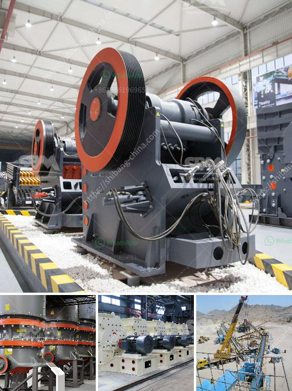

<h3>maize ball mills in south africa</h3>
Maize is one the most important crops in South Africa, playing a significant role in the country's economy and food security. Maize milling is a popular and essential process in the agriculture sector, providing maize flour, maize meal, and other maize products to consumers. As such, maize ball mills in South Africa are vital pieces of machinery that play a crucial role in the milling process.

The maize milling process requires maize to be ground into flour, which serves as the base ingredient for various food products. Maize ball mills are used to grind the maize into a fine powder, enabling easy processing and consumption of the flour. This milling process also removes the bran and germ from the maize, making it suitable for a wide range of applications, from baking bread to producing animal feed.

South Africa boasts an extensive maize cultivation industry, with a large number of farms dedicated to maize production. As a result, the demand for maize ball mills has significantly increased over the years. Manufacturers and suppliers have responded to this demand by producing high-quality ball mills specifically designed for maize milling purposes. These mills are typically equipped with robust machinery, including powerful motors, sharp blades, and sturdy materials to ensure efficient and durable operation.

In addition to meeting domestic demands, South African maize ball mills also contribute to exports. The country exports maize flour and other maize products to various African countries, where maize is a staple food. Reliable and efficient maize ball mills play a crucial role in meeting these export demands and maintaining South Africa's reputation as a reliable supplier of maize products.

Overall, maize ball mills are an essential part of the maize milling industry in South Africa. They contribute to the production of maize flour and other maize products, meeting both domestic and international demands. With the continuous growth of the agriculture sector, it is expected that the demand for maize ball mills will continue to rise, further promoting the development and technological advancement of this crucial machinery.
<h3>Contact us</h3><ul><li><strong>Whatsapp:&nbsp;<a href="https://wa.me/8613661969651">+8613661969651</a></strong></li><li><a href="https://swt.shibang-china.com/?git&amp;zhl&amp;maize ball mills in south africa"><strong>Online Service(chat now)</strong></a></li></ul><h3>Related</h3><ul><li><a href='marble grinding mills machine.md'>marble grinding mills machine</a></li><li><a href='crusher sand machine south africa.md'>crusher sand machine south africa</a></li><li><a href='rumus tegangan pada belt conveyor.md'>rumus tegangan pada belt conveyor</a></li><li><a href='price of a large mobile crusher.md'>price of a large mobile crusher</a></li><li><a href='dry grinding mill.md'>dry grinding mill</a></li></ul>