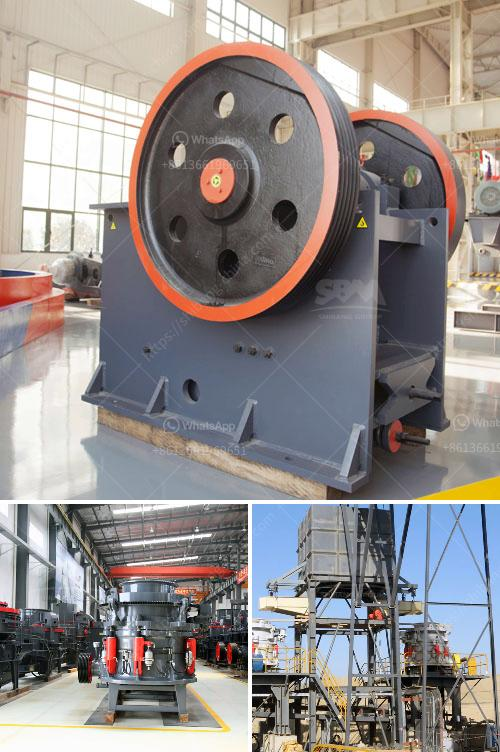

<h3>manganese metal production process</h3>
Manganese, a chemical element with the symbol Mn and atomic number 25, is an essential metal that plays a crucial role in several industrial applications. From steel production to battery manufacturing, manganese metal's versatility and properties make it a highly sought-after material. However, the process of producing manganese metal is an intricate journey that requires precision and expertise.

The production process of manganese metal begins with the mining of manganese ores. These ores are found in various regions globally, with large deposits present in South Africa, Australia, China, and Gabon. The composition of these ores can vary, but typically they consist of manganese dioxide (MnO2), mixed with iron, aluminum, and silica.

Once the manganese ores are extracted, they are processed to remove impurities and obtain pure manganese dioxide. This can be achieved through a variety of methods, including mechanical beneficiation, magnetic separation, and flotation. The chosen method depends on the characteristics of the ore and the desired purity.

After obtaining pure manganese dioxide, the next step in the production process involves reducing it to manganese metal. One common method used is the silicothermic process, which involves heating the manganese dioxide with silicon in an electric arc furnace. The chemical reaction between the manganese dioxide and silicon produces manganese metal and silicon dioxide as byproducts. The reaction is exothermic, meaning it releases heat, which helps sustain the process.

To ensure efficient reduction, the manganese dioxide and silicon are typically mixed with a flux, such as limestone or fluorspar. The flux helps to lower the melting point of the mixture, making it easier to handle and ensuring a smooth reduction process. Additionally, the presence of the flux aids in the removal of impurities, enhancing the quality of the final manganese metal product.

Once the reduction is complete, the resulting manganese metal is often cast into ingots, which can be further processed into different forms according to customer requirements. These forms can include flakes, powder, or even pellets, depending on the intended application of the manganese metal.

It is important to note that the production process of manganese metal involves various environmental and safety considerations. The mining and processing of manganese ores can have an impact on local ecosystems, which necessitates adherence to strict environmental regulations. Additionally, the handling of high temperatures during the reduction process requires specialized equipment and safety measures to protect workers and prevent accidents.

In conclusion, the production process of manganese metal is a complex and fascinating journey that begins with the mining of manganese ores and ends with the formation of pure manganese metal. This versatile metal, known for its properties and applications, is obtained through careful processing and reduction of manganese dioxide using methods like the silicothermic process. However, it is vital to ensure that these processes are carried out with due regard for the environment and safety guidelines. As the demand for manganese metal continues to grow, advancements in technology and sustainability measures will play a significant role in its production process.
<h3>Contact us</h3><ul><li><strong>Whatsapp:&nbsp;<a href="https://wa.me/8613661969651">+8613661969651</a></strong></li><li><a href="https://swt.shibang-china.com/?git&amp;zhl&amp;manganese metal production process"><strong>Online Service(chat now)</strong></a></li></ul><h3>Related</h3><ul><li><a href='cement clinker grinding ball mill manufacturer india.md'>cement clinker grinding ball mill manufacturer india</a></li><li><a href='gravel stone crusher plant.md'>gravel stone crusher plant</a></li><li><a href='construction and crusher machinery crusher machinery.md'>construction and crusher machinery crusher machinery</a></li><li><a href='complete crushing plant 150 200t.md'>complete crushing plant 150 200t</a></li><li><a href='automatic terrazzo pressing machine.md'>automatic terrazzo pressing machine</a></li></ul>