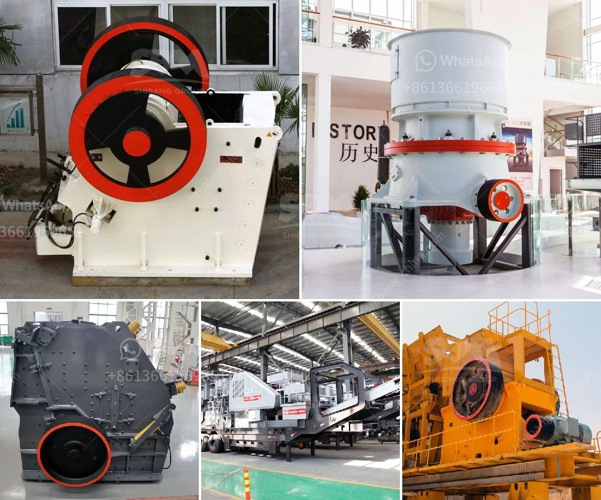

<h3>manganese ore washing plant and crusher in zambia</h3>
Manganese ore washing plant is a crucial machine in manganese ore beneficiation method, it plays crucial role in removing the impurity and gangue mixed within the manganese ore. It may also improve the manganese ore grade.

The washing plant for manganese ore might be a self-adequate crushing plant to crush manganese ore using a grizzly or vibration feeder to supply the vibrating screen and all sorts of crushing equipment and linked machines like belt conveyors. The washing plant is frequently utilized for manganese ore mining and beneficiation.

Manganese ore crusher will act as the primary crushing equipment in manganese ore crushing production line. Of course, there are also other crushing devices which can help to crush manganese ore. Secondary crushing equipment like hydraulic cone crusher, impact crusher, VSI crusher and mobile crushing plant can be used as secondary crushing machine.

The crushed manganese ore materials will be transferred to vibrating screen for separating. After separating, the particles that can meet requirements will be discharged as final products, while the remaining particles will be returned to cone crusher for secondary crushing.

Manganese ore washing plant and crusher in Zambia is an important equipment for washing manganese ore, and it can remove impurities, such as dust, light impurities and clay according to different ore properties and manganese ore amount. The plant can also improve the manganese ore grade, making it easier for smelting and other pyrometallurgical treatment.

There are many types of manganese ore washing plant and crusher in Zambia, including the jaw crusher, impact crusher, cone crusher, washing machine, and beneficiation equipment. These machines can be used for other metals, such as copper, and iron ore, which can also be used in beneficiation, and smelting industries.
<h3>Contact us</h3><ul><li><strong>Whatsapp:&nbsp;<a href="https://wa.me/8613661969651">+8613661969651</a></strong></li><li><a href="https://swt.shibang-china.com/?git&amp;zhl&amp;manganese ore washing plant and crusher in zambia"><strong>Online Service(chat now)</strong></a></li></ul><h3>Related</h3><ul><li><a href='precipitated calcium carbonate plant.md'>precipitated calcium carbonate plant</a></li><li><a href='suppliers of ball mill in bhopal.md'>suppliers of ball mill in bhopal</a></li><li><a href='ballast processing plant.md'>ballast processing plant</a></li><li><a href='quarry machines and prices.md'>quarry machines and prices</a></li><li><a href='process of mining silica rock crusher.md'>process of mining silica rock crusher</a></li></ul>