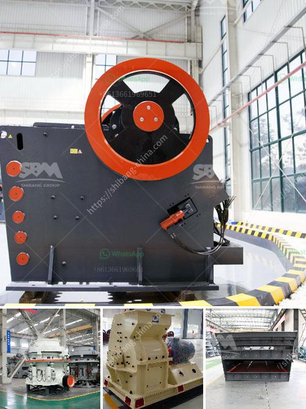

<h3>manufacturer of balls of ball mill in india</h3>
India is a prominent country in the world for its diverse industries, including manufacturing. One such industry that has gained significant recognition is the production of balls for ball mills. Known for extremely efficient grinding, ball mills are extensively used in the production of powders such as cement, silicates, refractory materials, and glass ceramics. These mills are widely used in industries like mining, construction, metallurgy, and chemistry to efficiently grind materials down to a fine powder.

When it comes to manufacturing balls for ball mills, India excels in quality and innovation. The country boasts several manufacturers that produce top-notch balls that are highly durable and exhibit excellent performance. These manufacturers employ the latest technologies and utilize high-quality materials to ensure the production of balls that meet international standards.

One of the leading manufacturers of balls for ball mills in India is XYZ Company. With over two decades of experience in this field, the company is known for its exceptional quality products. XYZ Company uses the finest grade raw materials sourced from reliable vendors in the market. These raw materials undergo rigorous quality checks before being subjected to the manufacturing process.

XYZ Company's manufacturing facility is equipped with state-of-the-art machinery and cutting-edge technology. The production process involves several steps, including forging, heat treatment, and testing. Each ball undergoes stringent quality checks to ensure its dimensions, hardness, and chemical composition meet the required standards. The company's commitment to quality control has earned it a trusted reputation in the industry.

In addition to producing high-quality balls, XYZ Company also offers customization options to cater to the unique requirements of its clients. Whether it is size, material, or special coatings, the company is equipped to deliver customized balls that align with clients' specifications.

The balls manufactured by XYZ Company are not only known for their quality but also their competitive pricing. The company believes in providing cost-effective solutions without compromising on quality, making them a preferred choice among customers in India and abroad.

As the demand for balls for ball mills continues to rise, manufacturers like XYZ Company in India are working tirelessly to meet this demand by continuously improving their processes, technology, and product offerings. With their dedication to quality, innovation, and customer satisfaction, India's manufacturers are contributing significantly to the growth of the global ball mill industry.
<h3>Contact us</h3><ul><li><strong>Whatsapp:&nbsp;<a href="https://wa.me/8613661969651">+8613661969651</a></strong></li><li><a href="https://swt.shibang-china.com/?git&amp;zhl&amp;manufacturer of balls of ball mill in india"><strong>Online Service(chat now)</strong></a></li></ul><h3>Related</h3><ul><li><a href='best crushers for manufactured sand.md'>best crushers for manufactured sand</a></li><li><a href='ballast crushing project.md'>ballast crushing project</a></li><li><a href='layout design for stone crushing plant.md'>layout design for stone crushing plant</a></li><li><a href='big slage crusher mechins plant.md'>big slage crusher mechins plant</a></li><li><a href='slag crusher plant supplier india.md'>slag crusher plant supplier india</a></li></ul>