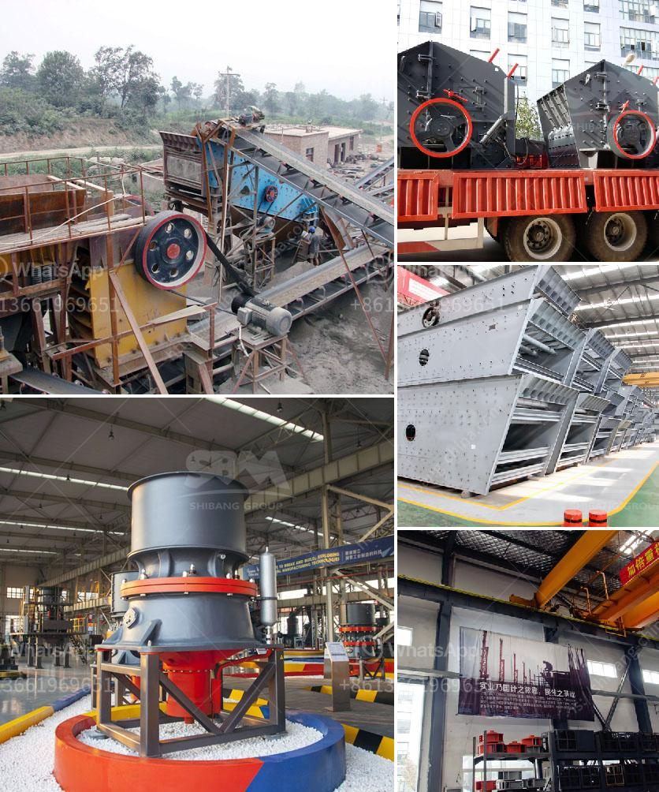

<h3>manufacturer of mineral beneficiation plant from china</h3>
China is known as the world's manufacturing powerhouse, producing a wide range of products that cater to diverse industries. One sector that has seen significant growth in recent years is the mineral beneficiation plant industry. China has emerged as a leading manufacturer of these plants, providing efficient and technologically advanced solutions to extract and process valuable minerals.

A mineral beneficiation plant, also known as ore processing plant, is designed to enrich various minerals from their natural ores and deliver them in a concentrated form. This process involves crushing, grinding, flotation, magnetic separation, and other techniques to separate valuable minerals from unwanted waste material.

Chinese manufacturers of mineral beneficiation plants have gained a reputation for their high-quality equipment and cutting-edge technology. These companies leverage their expertise to deliver state-of-the-art solutions that not only increase the efficiency of mineral processing but also minimize environmental impact.

The mineral beneficiation plants manufactured in China are designed to process a wide range of minerals, including iron ore, copper ore, manganese ore, graphite ore, and many others. These plants are equipped with advanced machinery and equipment, such as crushers, vibrating screens, grinding mills, magnetic separators, and flotation cells, to ensure optimal processing efficiency.

Another advantage of choosing a manufacturer of mineral beneficiation plants from China is the cost-effectiveness of their solutions. Chinese manufacturers have a competitive edge in terms of pricing, making their products more affordable compared to their counterparts in other countries. This makes it an attractive proposition for businesses operating in the mining and mineral processing sector.

Moreover, Chinese manufacturers of mineral beneficiation plants prioritize research and development to continuously enhance their products' performance. They invest in state-of-the-art technologies and employ skilled engineers and technicians to ensure their plants meet the evolving demands of the industry.

In conclusion, China has emerged as a leading manufacturer of mineral beneficiation plants, offering advanced solutions that facilitate the extraction and processing of valuable minerals. The Chinese manufacturers' commitment to innovation, affordability, and quality has contributed to their success in this industry. As the demand for efficient mineral processing solutions continues to rise, China's manufacturers are poised to play a crucial role in meeting the global needs of the mining sector.
<h3>Contact us</h3><ul><li><strong>Whatsapp:&nbsp;<a href="https://wa.me/8613661969651">+8613661969651</a></strong></li><li><a href="https://swt.shibang-china.com/?git&amp;zhl&amp;manufacturer of mineral beneficiation plant from china"><strong>Online Service(chat now)</strong></a></li></ul><h3>Related</h3><ul><li><a href='crushing aggregates philippines.md'>crushing aggregates philippines</a></li><li><a href='sand washing machinery.md'>sand washing machinery</a></li><li><a href='cost of conveyor belt system for coal loading.md'>cost of conveyor belt system for coal loading</a></li><li><a href='quotation for iron ore processing.md'>quotation for iron ore processing</a></li><li><a href='used crusher plant in uae.md'>used crusher plant in uae</a></li></ul>