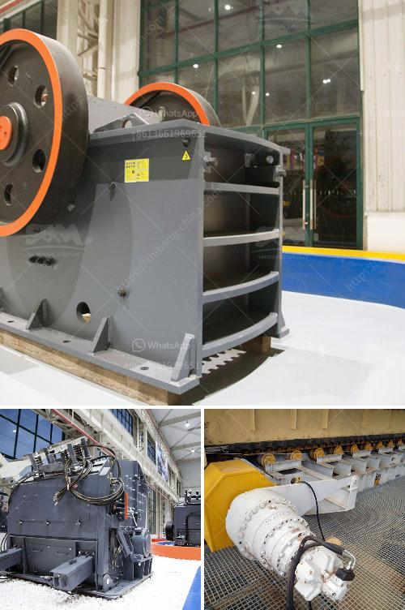

<h3>manufacturer of portable floatation plant in china</h3>
China has long been known as a manufacturing powerhouse, producing a wide range of products that cater to various industries across the globe. One such industry that has witnessed significant growth in China is the manufacturing of portable flotation plants.

A portable flotation plant is a crucial piece of equipment used in mining and mineral processing operations. It is designed to separate valuable minerals from waste materials, ensuring maximum efficiency and productivity. These plants are especially useful in remote locations where traditional flotation plants may not be feasible.

When it comes to portable flotation plants, China stands out as a leading manufacturer. Numerous companies in China specialize in the production of these plants, offering high-quality products that meet international standards. These manufacturers utilize advanced technology and innovative design techniques to ensure the plants are efficient, reliable, and easy to operate.

China's manufacturers of portable flotation plants have established a solid reputation for their commitment to excellence and customer satisfaction. They understand the complexities and challenges faced by the mining industry and strive to provide tailored solutions that meet specific requirements.

Furthermore, Chinese manufacturers of portable flotation plants offer competitive prices without compromising on quality. This has made them a preferred choice for businesses looking to invest in reliable and cost-effective solutions.

In addition to their high-quality products, Chinese manufacturers also provide excellent after-sales service, ensuring customers receive prompt assistance and support when required. This commitment to customer satisfaction has earned them loyalty and trust from clients worldwide.

As the demand for portable flotation plants continues to grow, China's manufacturers are constantly innovating and improving their products to stay ahead in the market. They invest in research and development to enhance the efficiency and performance of their plants, making them even more valuable assets for mining operations.

In conclusion, China's manufacturers of portable flotation plants have proven their expertise and reliability in the industry. With their high-quality products, competitive prices, and exceptional after-sales service, they continue to dominate the market and serve as a trusted partner for businesses in need of portable flotation plants. Whether it is for mining projects or mineral processing operations, choosing a manufacturer from China ensures businesses have access to world-class equipment that delivers optimal results.
<h3>Contact us</h3><ul><li><strong>Whatsapp:&nbsp;<a href="https://wa.me/8613661969651">+8613661969651</a></strong></li><li><a href="https://swt.shibang-china.com/?git&amp;zhl&amp;manufacturer of portable floatation plant in china"><strong>Online Service(chat now)</strong></a></li></ul><h3>Related</h3><ul><li><a href='raymond mill supplier.md'>raymond mill supplier</a></li><li><a href='talcum powder making machinery.md'>talcum powder making machinery</a></li><li><a href='prices of gemini concentrating tables manufacturers.md'>prices of gemini concentrating tables manufacturers</a></li><li><a href='impact hammer crusher.md'>impact hammer crusher</a></li><li><a href='cement manufacturing equipment pdf.md'>cement manufacturing equipment pdf</a></li></ul>