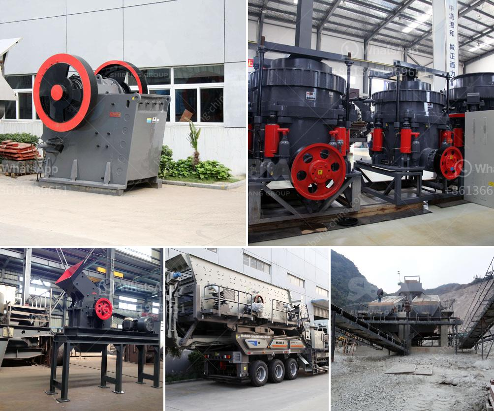

<h3>manufacturer of stone crusher</h3>
A stone crusher, also known as rock crusher, is one of the most commonly used mining and construction equipment industries. It is designed to crush large rocks into smaller pieces to be used in construction sites, civil engineering projects, and other infrastructure purposes. There are different types of stone crushers, including cone crushers, jaw crushers, impact crushers, and even mobile crushers, each with unique features and advantages.

One of the key players in the stone crushing equipment industry is the manufacturer known as AIMIX Crusher Machine. This company's highly skilled engineers have designed and manufactured a wide variety of stone crushers for various applications. With over 30 years of experience, AIMIX has developed advanced crushing technology that has been implemented in their machinery.

AIMIX offers a wide range of stone crushers, ensuring that their customers have the right equipment to meet their specific needs. Their machines are designed to handle various types of materials, including limestone, granite, basalt, river pebble, and more. Furthermore, AIMIX stone crushers are available in different sizes and capacities, allowing customers to choose the most suitable option for their project requirements.

One of the key features of AIMIX stone crushers is their high efficiency and productivity. Their equipment is designed to maximize the output of crushed materials while reducing energy consumption. This not only increases the profitability of the projects but also helps in reducing the environmental impact. AIMIX achieves this by incorporating innovative technology, such as hydraulic systems, which improve the efficiency of the crushing process.

AIMIX stone crushers are also known for their reliability and durability. Each machine is built using high-quality materials that can withstand heavy-duty operations and harsh working conditions. This ensures minimal downtime and maximizes the lifespan of the equipment.

In addition to their high-quality machinery, AIMIX also offers excellent after-sales service to their customers. Their team of expert technicians is always available to provide assistance, guidance, and technical support whenever needed. AIMIX also stocks a wide range of spare parts for their stone crushers, guaranteeing a quick and efficient replacement whenever required.

Moreover, AIMIX prioritizes safety in their designs. Their machines are equipped with safety features, such as emergency stop buttons and advanced control systems that prevent accidents and potential hazards in the workplace. This makes AIMIX stone crushers a reliable and safe choice for any construction or mining project.

AIMIX has built a strong reputation as a leading manufacturer of stone crushers worldwide. Their commitment to quality, innovation, and customer satisfaction has made them a trusted partner for many construction companies, contractors, and mining industries. With AIMIX stone crushers, customers can expect high-performance equipment that delivers exceptional results.

In conclusion, a stone crusher is an essential piece of equipment for construction and mining projects. AIMIX, a leading manufacturer in the industry, offers a wide range of stone crushers that can fit any project requirement. Their machines are known for their efficiency, durability, and safety features, making them a reliable choice for any job. Whether it's a small-scale project or a large-scale construction site, AIMIX stone crushers are designed to deliver superior performance and outstanding results.
<h3>Contact us</h3><ul><li><strong>Whatsapp:&nbsp;<a href="https://wa.me/8613661969651">+8613661969651</a></strong></li><li><a href="https://swt.shibang-china.com/?git&amp;zhl&amp;manufacturer of stone crusher"><strong>Online Service(chat now)</strong></a></li></ul><h3>Related</h3><ul><li><a href='used hammer mill.md'>used hammer mill</a></li><li><a href='chrome washing plant in south africa.md'>chrome washing plant in south africa</a></li><li><a href='project on stone crushing unit.md'>project on stone crushing unit</a></li><li><a href='crusher processing plant malaysia.md'>crusher processing plant malaysia</a></li><li><a href='quartz crushing plant german tecnology.md'>quartz crushing plant german tecnology</a></li></ul>