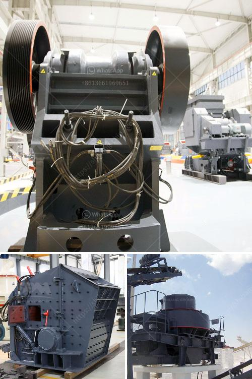

<h3>manufacturers of cement grinding units in india</h3>
India is one of the fastest-growing economies in the world, and as the country continues to develop, infrastructure projects such as roads, bridges, and buildings are on the rise. The demand for cement is consequently increasing, leading to a boom in the cement industry. Manufacturers of cement grinding units in India play a crucial role in meeting this demand.

Cement grinding units are used to prepare and grind the raw materials required for the production of cement. These units are located near big cities and are equipped with state-of-the-art machinery to ensure high-quality cement production. The grinding process involves crushing and grinding the raw materials to achieve the desired consistency, and manufacturers in India are renowned for their expertise in this field.

One of the main manufacturers of cement grinding units in India is UltraTech Cement. With five integrated cement manufacturing plants and eight grinding units across the country, UltraTech Cement is a leading player in the cement industry. The company manufactures various types of cement, such as Portland, fly ash-based, and white cement, supplying it to both the domestic and international markets.

Another prominent manufacturer is ACC Limited. With 17 modern cement factories and more than 50 ready-to-mix plants, ACC Limited ensures a steady supply of high-quality cement. The company has also invested in advanced grinding units to optimize the production process and deliver superior cement products.

Apart from these giants, there are several other manufacturers of cement grinding units in India, such as Ramco Cements, Dalmia Cement, and JK Cement. These manufacturers focus on innovation, sustainability, and customer satisfaction to differentiate themselves in the highly competitive market.

In conclusion, the manufacturers of cement grinding units play a vital role in meeting the growing demand for cement in India. These units employ advanced technology and processes to ensure high-quality cement production. With the construction industry flourishing, the demand for cement is expected to rise further, creating opportunities for manufacturers to expand their operations and contribute to India's infrastructure development.
<h3>Contact us</h3><ul><li><strong>Whatsapp:&nbsp;<a href="https://wa.me/8613661969651">+8613661969651</a></strong></li><li><a href="https://swt.shibang-china.com/?git&amp;zhl&amp;manufacturers of cement grinding units in india"><strong>Online Service(chat now)</strong></a></li></ul><h3>Related</h3><ul><li><a href='cement clinker ball mill.md'>cement clinker ball mill</a></li><li><a href='gold ore hammer mills prices mining supplies in zimbabwe.md'>gold ore hammer mills prices mining supplies in zimbabwe</a></li><li><a href='crusher for sale 120 ton.md'>crusher for sale 120 ton</a></li><li><a href='rock crusher production screen mesh.md'>rock crusher production screen mesh</a></li><li><a href='iron ore processing machine.md'>iron ore processing machine</a></li></ul>