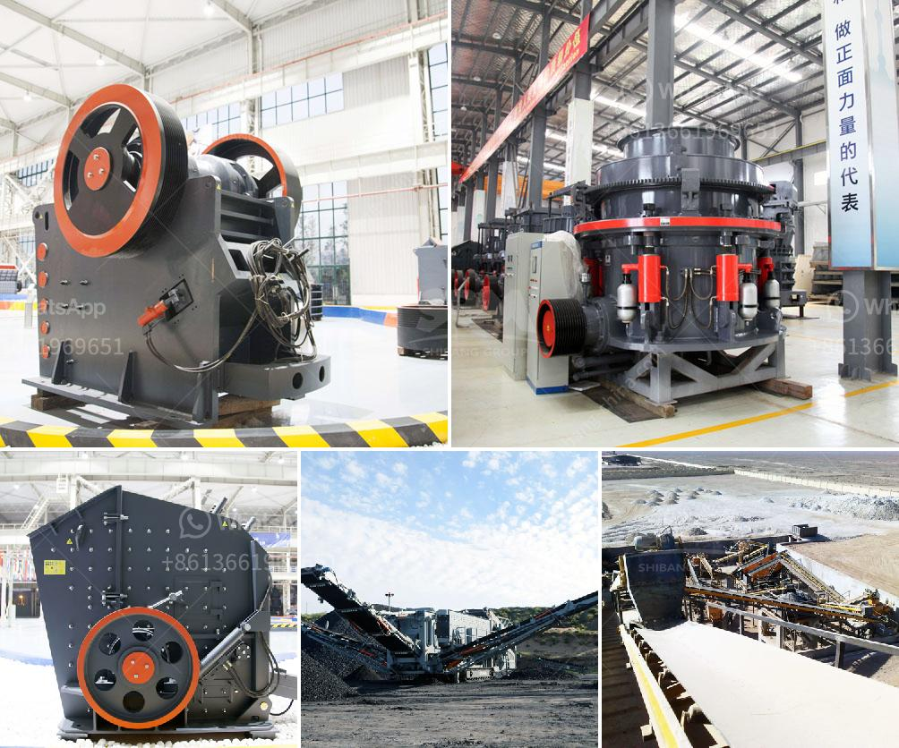

<h3>manufacturing talcum powder in india</h3>
Talcum powder, a versatile and essential product in the cosmetics industry, has been used for centuries for its soothing and absorbing properties. India, being one of the major producers of talc, has become a hub for the manufacturing of talcum powder, contributing significantly to the global market. This article explores the process of manufacturing talcum powder in India and the impact it has on the cosmetics industry.

The production of talcum powder begins with sourcing the raw material, talc. India is blessed with abundant reserves of high-quality talc, primarily found in various states like Rajasthan, Uttarakhand, Bihar, and Madhya Pradesh. These regions provide large deposits of talc, ensuring a consistent and reliable supply to manufacturers.

To extract talc from the mines, a conventional mining method is employed. The ore is initially excavated from the deposit and then transported to the processing plants. In India, advanced techniques and modern machinery are used to ensure efficient mining and processing of talc. This includes crushing, drying, and grinding the extracted talc, resulting in a fine powder.

Manufacturers in India place significant emphasis on quality control to meet international standards and ensure consumer safety. State-of-the-art laboratories are equipped with sophisticated testing instruments to analyze the purity, particle size, and moisture content of the final product. Stringent quality control measures are followed, adhering to regulations set by regulatory authorities, including the Food and Drug Administration (FDA) and Bureau of Indian Standards (BIS).

Once the talc powder is processed and quality checked, it undergoes formulation to suit various cosmetic applications. Different grades of talc are used depending on the intended use, such as loose powder, compact powder, foundations, and baby powders. Manufacturers work closely with cosmetic companies to tailor the product formulation according to their specific requirements.

After the formulation process, the final talcum powder is packaged into suitable containers, ranging from small sachets to larger bottles or jars. Packaging plays a crucial role in preserving the product's quality and preventing contamination during transportation and storage.

Talcum powder manufactured in India is widely used in the cosmetics industry worldwide. Its main application is as a body deodorant and absorbent, as it helps to keep the skin dry and fresh. Furthermore, talcum powder is used as a component in face powders, blush, eyeshadows, and various personal care products.

India's expertise in talcum powder manufacturing has made it a major player in the global market. The country exports significant quantities of talcum powder to various countries, including the United States, Europe, and the Middle East. This exports boost the Indian economy and foster international trade relations.

The process of manufacturing talcum powder in India is a testament to the country's natural resources and technological advancements. With its high-quality talc reserves, state-of-the-art processing techniques, and stringent quality control measures, India has established itself as a reliable manufacturer in the cosmetics industry. The availability of talcum powder in various forms supports its use in multiple cosmetic applications, meeting the demands of consumers worldwide.
<h3>Contact us</h3><ul><li><strong>Whatsapp:&nbsp;<a href="https://wa.me/8613661969651">+8613661969651</a></strong></li><li><a href="https://swt.shibang-china.com/?git&amp;zhl&amp;manufacturing talcum powder in india"><strong>Online Service(chat now)</strong></a></li></ul><h3>Related</h3><ul><li><a href='belt conveyor 12mm.md'>belt conveyor 12mm</a></li><li><a href='mining equipment used in mining industry.md'>mining equipment used in mining industry</a></li><li><a href='mini concrete crusher in united kingdom.md'>mini concrete crusher in united kingdom</a></li><li><a href='sand and gravel crusher suppliers located in cebu.md'>sand and gravel crusher suppliers located in cebu</a></li><li><a href='equipments of copper processing.md'>equipments of copper processing</a></li></ul>