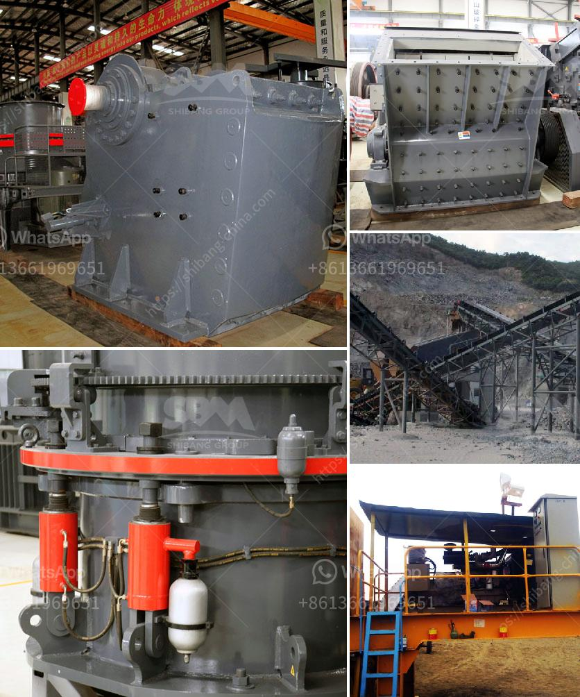

<h3>marble ball mill</h3>
Marble is a popular material used for sculptures, countertops, flooring, and decorative pieces, among many other applications. Its unique properties make it ideal for various industries around the world. However, the process of extracting, shaping, and refining marble is not an easy task, especially when it comes to grinding it into fine powder for various uses.

This is where the marble ball mill comes into play. A marble ball mill is a type of grinding equipment used to grind and blend materials. It is a cylindrical device with a chamber that is filled with ceramic or stainless-steel balls and the material to be ground. The rotation of the chamber causes the balls to cascade and grind the material, resulting in a fine powder.

The marble ball mill has undergone various technological advancements to make it more efficient. One notable improvement was the incorporation of water cooling systems on the external part of the ball mill. This allowed for the efficient cooling of the chamber, preventing overheating. Additionally, the use of high-quality materials in the construction of the ball mill ensures its durability and longevity, even when handling hard materials like marble.

The marble ball mill offers several advantages over traditional grinding methods. Firstly, it is energy-efficient, as it consumes less power compared to other grinding techniques. This is due to the cascading motion of the balls, which accelerates the grinding process while minimizing energy consumption.

Secondly, the marble ball mill provides a consistent and homogeneous grind. The rotating balls ensure that all the material in the chamber is subjected to grinding, resulting in a uniform powder. This is crucial for applications such as the production of marble countertops, where uniformity is essential for a polished finish.

Lastly, the marble ball mill is versatile and can be used for both wet and dry grinding. It can grind materials of various hardness levels, making it suitable for a wide range of industries. This adaptability allows manufacturers to produce different grades of marble powder for different purposes.

In conclusion, marble ball mills have revolutionized the way marble is processed, providing an efficient and reliable method for grinding marbles into fine powder. The advancements in technology have made these mills more energy-efficient, consistent, and versatile. As the demand for marble in various industries continues to grow, the marble ball mill will undoubtedly play a crucial role in meeting the requirements of manufacturers worldwide.
<h3>Contact us</h3><ul><li><strong>Whatsapp:&nbsp;<a href="https://wa.me/8613661969651">+8613661969651</a></strong></li><li><a href="https://swt.shibang-china.com/?git&amp;zhl&amp;marble ball mill"><strong>Online Service(chat now)</strong></a></li></ul><h3>Related</h3><ul><li><a href='slag vertical mill.md'>slag vertical mill</a></li><li><a href='clay grinding mill machine price in china.md'>clay grinding mill machine price in china</a></li><li><a href='calcium carbide manufacturing plant.md'>calcium carbide manufacturing plant</a></li><li><a href='silica sand production line stone crusher machine.md'>silica sand production line stone crusher machine</a></li><li><a href='allis chalmers 54 x 74 gyratory crusher.md'>allis chalmers 54 x 74 gyratory crusher</a></li></ul>