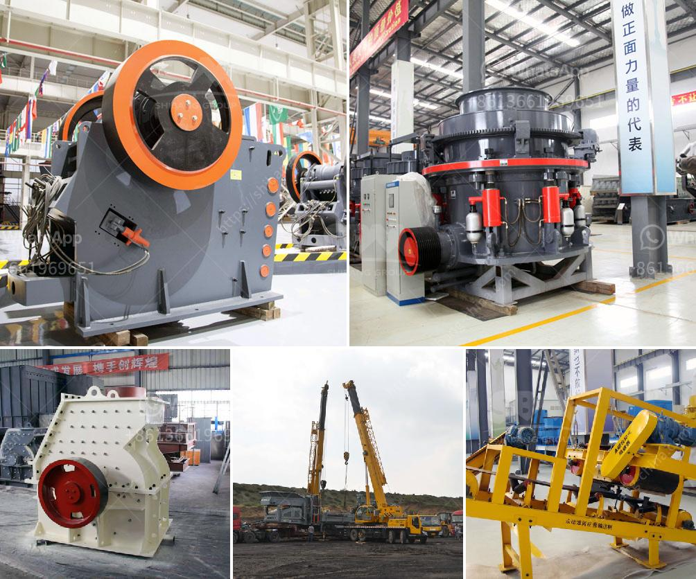

<h3>marble crusher for sale</h3>
Marble, a key decorative material that has been used for centuries, is being mined on an unprecedented scale. With advancements in mining technology, marble mining has become easier and safer, resulting in increased production and reduced costs. One such technological marvel that has transformed the mining industry is the marble crusher.

A marble crusher is an essential tool in the process of breaking down marble into smaller pieces of uniform size. The size of the marble crusher can be adjusted according to customer requirements, allowing for greater flexibility and optimal versatility. The marble crusher comes in several different models to meet the varying needs of customers. Some of the popular models include hydraulic cone crusher, jaw crusher, and impact crusher.

The impact of intelligent technology on the mining industry is undeniable, and the marble crusher is a prime example of the advancements achieved. While traditional crushers required prompt maintenance, causing downtime and added expense, intelligent marble crushers are equipped with automated systems that enable remote monitoring and maintenance. This eliminates the need for manual maintenance, saving time and reducing costs.

Moreover, marble crushers are now equipped with sensors and intelligent systems that can detect variations in input material hardness and adjust crushing parameters accordingly. This ensures optimal crushing performance and reduces the risk of damaging the crusher or producing subpar crushed marble.

The availability of marble crusher for sale has opened up new opportunities for small-scale marble quarries which, traditionally, have been unable to access modern crushing technology. With the advantage of being able to acquire a mobile marble crusher, these quarries can now crush marble at economical rates, even in remote locations.

In conclusion, the marble crusher is a game-changer in the mining industry, providing an efficient and reliable way of processing marble into valuable products. The impact of intelligent technology has made mining operations safer, more flexible, and more profitable. With the availability of marble crushers for sale, small-scale quarries can now enter the market, contributing to economic growth and job creation.
<h3>Contact us</h3><ul><li><strong>Whatsapp:&nbsp;<a href="https://wa.me/8613661969651">+8613661969651</a></strong></li><li><a href="https://swt.shibang-china.com/?git&amp;zhl&amp;marble crusher for sale"><strong>Online Service(chat now)</strong></a></li></ul><h3>Related</h3><ul><li><a href='fine powder milling machines.md'>fine powder milling machines</a></li><li><a href='diagram of hammer mill machine.md'>diagram of hammer mill machine</a></li><li><a href='sample of gold mining business plan in ghana.md'>sample of gold mining business plan in ghana</a></li><li><a href='sand washing machinery.md'>sand washing machinery</a></li><li><a href='slag vertical mill.md'>slag vertical mill</a></li></ul>