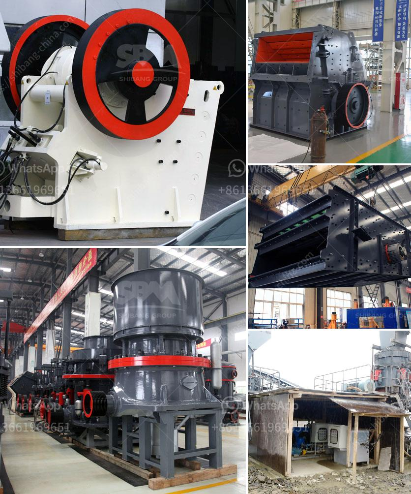

<h3>marble crusher machinery manufacturer</h3>
Marble is a popular natural stone used for decorative and architectural purposes worldwide. It is widely used for flooring, countertops, sculptures, and other applications due to its aesthetic appeal, durability, and versatility. To extract marble from quarries, it requires heavy machinery and equipment to crush the marble into desirable sizes. This is where marble crusher machinery manufacturers come into play.

Marble crusher machinery manufacturers have developed a range of machinery and equipment including heavy-duty crushers, compactors, and other machines that are essential for crushing and grinding marble. These machines are designed to handle big blocks of marble and transform them into smaller pieces for further processing or use.

One of the leading marble crusher machinery manufacturers is Shanghai Zenith Mining and Construction Machinery Co., Ltd. Zenith provides high-performance marble crushing machinery and equipment for the mining and construction industry. They specialize in the research, development, and production of crushing, grinding, sand making, and mineral processing equipment.

The marble crusher machinery manufactured by Zenith includes jaw crushers, impact crushers, cone crushers, and other crushing equipment. These machines have the advantages of large capacity and high efficiency, which is suitable for both large-scale and small-scale marble crushing projects. Zenith's marble crusher machinery is flexible to operate and can be combined into different configurations according to customers' requirements.

Another prominent marble crusher machinery manufacturer is Liming Heavy Industry. They are committed to providing customers with high-quality products, advanced technology, and excellent after-sales service. Liming Heavy Industry's marble crusher machinery includes jaw crushers, cone crushers, vertical impact crushers, horizontal impact crushers, circular vibrating screens, and other related equipment. Their breakthrough design principles and production processes have made their machines highly efficient and reliable.

Choosing a reliable marble crusher machinery manufacturer is crucial for any marble crushing project. These manufacturers should have a strong reputation in the industry, extensive experience, and a robust support system. It is essential to consider factors such as the quality of the machinery, production capacity, service life, and after-sales service provided by the manufacturer.

In conclusion, marble crusher machinery manufacturers play a vital role in the marble industry. Their advanced machinery and equipment enable the extraction and crushing of marble into smaller, desirable sizes for various applications. Marble crusher machinery manufacturers like Zenith and Liming Heavy Industry provide high-quality machines that meet the increasing demand for marble crushing worldwide. Their reliable products, efficient operation, and excellent after-sales service make them popular choices for customers in the mining and construction industry.
<h3>Contact us</h3><ul><li><strong>Whatsapp:&nbsp;<a href="https://wa.me/8613661969651">+8613661969651</a></strong></li><li><a href="https://swt.shibang-china.com/?git&amp;zhl&amp;marble crusher machinery manufacturer"><strong>Online Service(chat now)</strong></a></li></ul><h3>Related</h3><ul><li><a href='diamond dms plant for sale south africa.md'>diamond dms plant for sale south africa</a></li><li><a href='price of a large mobile crusher.md'>price of a large mobile crusher</a></li><li><a href='used stone crusher in ontario.md'>used stone crusher in ontario</a></li><li><a href='gypsum production process plant design.md'>gypsum production process plant design</a></li><li><a href='ball mill 5 tonnes.md'>ball mill 5 tonnes</a></li></ul>