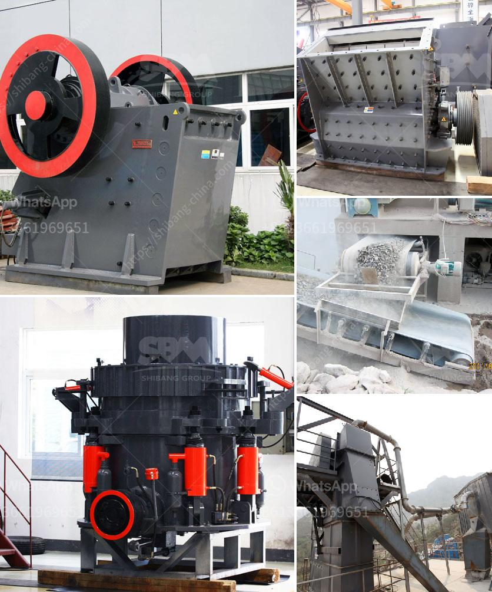

<h3>marble crusher machines usa</h3>
Marbles have been a staple decoration piece for centuries. In the modern era, with advancements in technology, the use of marbles has expanded beyond aesthetics. Industries such as construction and manufacturing rely heavily on marbles for various applications. However, before these marbles can be used, they need to go through a crushing process. This is where marble crusher machines come into play. In the United States, these machines have become an essential tool for marble processing.

Marble crusher machines in the USA are ideal for various crushing applications. They are suitable for crushing marble stones into desired particle sizes that can be used in various applications. These machines include jaw crushers, cone crushers, impact crushers, and hammer crushers. Each of these crushers has unique features and is used for specific crushing purposes.

Jaw crushers are the most popular choice for crushing marbles. They are capable of crushing large-sized marbles into smaller particles. The mechanism of a jaw crusher involves a pair of vertical jaws that move in a V-shaped pattern to compress the marbles between them. This process breaks the marbles into smaller sizes, ready to be used in different manufacturing processes.

Cone crushers are another type of marble crusher machines used in the USA. They are generally used for secondary or tertiary crushing purposes. Cone crushers work by squeezing the marbles between an eccentrically rotating mantle and a concave bowl liner. The crushed marbles are discharged through a small opening at the bottom of the crusher.

For finer crushing, impact crushers are commonly used. These machines use a high-speed rotor and hammers to strike the marbles and break them into smaller pieces. Impact crushers are suitable for processing marbles with medium hardness.

Hammer crushers, on the other hand, are ideal for crushing marbles with low hardness. They consist of a rotating shaft with hammers attached to it. The hammers strike the marbles as the shaft rotates, reducing them to the desired size.

The use of marble crusher machines in the United States has revolutionized the marble mining industry. With advancements in technology, companies can now extract marbles in blocks and process them with a marble crusher machine to produce marble chips, crushed stones, granules, and other useful products for different industries.

The advantages of using marble crusher machines in the USA are numerous. They allow companies to recycle waste marbles and create new products from them. Additionally, these crushers improve the efficiency of marble mining operations by reducing the amount of manual labor required. They also minimize the risk of worker injuries since automated machines are used for crushing marbles.

In conclusion, marble crusher machines in the USA have become an indispensable tool for the marble processing industry. With their ability to crush marbles into various sizes, these machines enhance the efficiency and productivity of marble mining operations. Companies can easily produce marble chips and other valuable products from waste marbles, reducing environmental impact. Therefore, investing in marble crusher machines is a wise decision for any marble-related business in the United States.
<h3>Contact us</h3><ul><li><strong>Whatsapp:&nbsp;<a href="https://wa.me/8613661969651">+8613661969651</a></strong></li><li><a href="https://swt.shibang-china.com/?git&amp;zhl&amp;marble crusher machines usa"><strong>Online Service(chat now)</strong></a></li></ul><h3>Related</h3><ul><li><a href='rock crusher machine for sale philippines.md'>rock crusher machine for sale philippines</a></li><li><a href='rock crusher machine.md'>rock crusher machine</a></li><li><a href='rumus perhitungan kapasitas jaw crusher.md'>rumus perhitungan kapasitas jaw crusher</a></li><li><a href='consol glass cullet price per ton south africa.md'>consol glass cullet price per ton south africa</a></li><li><a href='gypsum board powder plant in ethiopia.md'>gypsum board powder plant in ethiopia</a></li></ul>