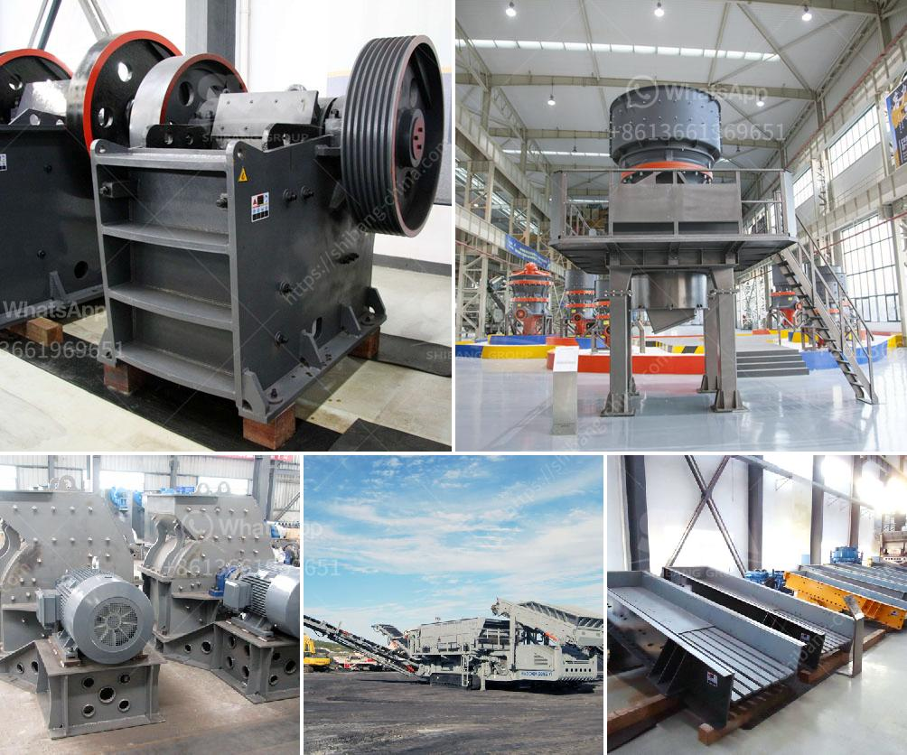

<h3>marble grinding machines factory in turkey</h3>
Marble is a natural stone that has been used for centuries in various applications such as construction, art, and decoration. It is renowned for its beauty and durability, making it a popular choice for both commercial and residential projects. With the increasing demand for high-quality marble products, the need for efficient marble grinding machines has also grown.

Turkey is one of the leading countries in the marble industry, with a rich history and extensive marble reserves. Turkish marble is highly sought after worldwide due to its unique colors, patterns, and quality. To meet the growing demand for processed marble, many marble grinding machine factories have been established in Turkey.

A marble grinding machine is a specialized equipment specifically designed for grinding and polishing marble stones. With careful planning and the use of advanced machinery, these factories produce high-quality marble products efficiently and effectively. The process involves several steps, including cutting, grinding, polishing, and finishing.

One of the leading marble grinding machine factories in Turkey is Acemar Machinery. With years of experience in the industry, Acemar Machinery has gained a reputation for producing top-of-the-line marble grinding machines. Their factory is equipped with state-of-the-art machinery and employs skilled technicians and engineers who are experts in marble processing.

Acemar Machinery offers a wide range of marble grinding machines suitable for various applications. They provide machines for both small and large-scale production, ensuring that their customers' needs are met. The machines are designed to be durable, efficient, and easy to operate, making them the ideal choice for marble processing businesses.

In addition to producing high-quality machines, Acemar Machinery also offers comprehensive after-sales service. They provide training and support to their customers, ensuring that the machines are used correctly and efficiently. This helps to maximize productivity and reduce downtime, allowing businesses to meet their production targets.

Moreover, Acemar Machinery is committed to sustainability and environmental responsibility. They make use of advanced technology and techniques to reduce waste and energy consumption in their manufacturing process. This ensures that their machines are eco-friendly and contribute to a greener future.

With the growing demand for marble products, the marble grinding machine industry in Turkey is poised for further growth. The factories in Turkey are continuously investing in research and development to improve their machines' performance and efficiency. This will help them meet the evolving needs of the market and maintain their competitive edge.

In conclusion, Turkey is home to several marble grinding machine factories that produce high-quality and efficient machines. These factories, such as Acemar Machinery, play a crucial role in meeting the increasing demand for marble products. With their advanced machinery, skilled workforce, and commitment to sustainability, they ensure that the marble grinding industry in Turkey remains at the forefront of the global market.
<h3>Contact us</h3><ul><li><strong>Whatsapp:&nbsp;<a href="https://wa.me/8613661969651">+8613661969651</a></strong></li><li><a href="https://swt.shibang-china.com/?git&amp;zhl&amp;marble grinding machines factory in turkey"><strong>Online Service(chat now)</strong></a></li></ul><h3>Related</h3><ul><li><a href='ton crushing machine.md'>ton crushing machine</a></li><li><a href='price of crusher machine.md'>price of crusher machine</a></li><li><a href='granite mining in zimbabwe.md'>granite mining in zimbabwe</a></li><li><a href='micro mill grinding mills.md'>micro mill grinding mills</a></li><li><a href='aggregate concrete plant.md'>aggregate concrete plant</a></li></ul>