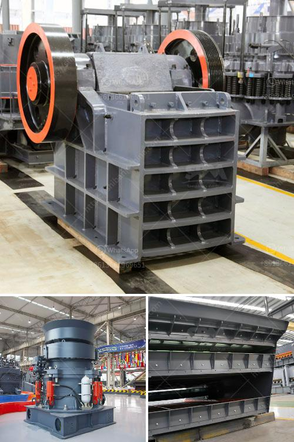

<h3>marble grinding mills machine</h3>
Marble, a type of metamorphic rock, has been used for centuries in various forms of art, architecture, and construction. It is highly valued for its elegance, durability, and natural beauty. However, the process of transforming raw marble into functional and aesthetically pleasing objects or structures requires skilled craftsmanship and the use of advanced machinery. One such machine that plays a crucial role in marble processing is the marble grinding mills machine.

Marble grinding mills machine, also known as grinding mill, is utilized for grinding marble stones into powder. In this process, the marble is crushed under pressure into smaller particles, thereby transforming it into a fine powder. The powder is then used in various applications such as paint, cosmetics, ceramics, and many more.

The key component of the marble grinding mills machine is the grinding roller device, which resembles a large cylindrical roller. During the grinding process, the roller rotates around its axis, causing the marble stones to be crushed and ground. The crushed particles are then conveyed to the classifier, where they are further separated based on their size and consistency. The finer particles are collected and stored while the larger ones are sent back for further grinding.

To ensure efficient and effective grinding, the marble grinding mills machine is equipped with a powerful motor that generates a high rotational speed. This speed enables the machine to grind the marble stones with precision and accuracy, resulting in a consistent and uniform powder. Additionally, the machine is often equipped with advanced control systems to monitor and adjust the grinding process, ensuring optimal performance.

Marble grinding mills machines come in various sizes and configurations to cater to different production requirements. Small-scale machines are suitable for individual artisans or small workshops, while larger machines are used in industrial settings for mass production. Regardless of their size, marble grinding mills machines are designed to be durable and long-lasting, capable of withstanding the demanding conditions of continuous operation.

In addition to its role in marble processing, the marble grinding mills machine also contributes to environmental sustainability. The process of grinding marble results in the generation of marble dust, which can be harmful to human health and the environment. However, modern grinding mills machines are equipped with advanced dust collection systems, effectively capturing and containing the dust particles during the grinding process. This minimizes the release of dust into the atmosphere, promoting a cleaner and healthier working environment.

In conclusion, marble grinding mills machines play a crucial role in the transformation of raw marble into fine powder. They are essential for various applications such as paint, cosmetics, and ceramics. With their powerful motor, precision grinding capabilities, and advanced control systems, these machines ensure efficient and consistent grinding. Additionally, their dust collection systems promote environmental sustainability. As the demand for marble products continues to grow, the role of marble grinding mills machines will remain indispensable in the marble processing industry.
<h3>Contact us</h3><ul><li><strong>Whatsapp:&nbsp;<a href="https://wa.me/8613661969651">+8613661969651</a></strong></li><li><a href="https://swt.shibang-china.com/?git&amp;zhl&amp;marble grinding mills machine"><strong>Online Service(chat now)</strong></a></li></ul><h3>Related</h3><ul><li><a href='roller mill manufacturer.md'>roller mill manufacturer</a></li><li><a href='used gold mill for sale south africa.md'>used gold mill for sale south africa</a></li><li><a href='vertical roller mill manufacture in tamilnadu.md'>vertical roller mill manufacture in tamilnadu</a></li><li><a href='caco3 carbonate calcium line production.md'>caco3 carbonate calcium line production</a></li><li><a href='mobile crushing station.md'>mobile crushing station</a></li></ul>