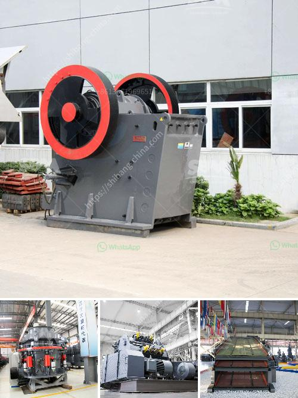

<h3>marble jaw crusher</h3>
Marble is a popular material for countertops, flooring, and various other decorative elements in homes and buildings. Knowing the best way to maintain marble's illustrious appearance, it is essential to have a reliable crushing machine to process and crush the marble into desired aggregates.

One such machine is the marble jaw crusher, which is widely used in the crushing of marble and other hard materials. As with any machine, it is important to perform regular maintenance to prolong the life of the crusher and ensure it consistently produces aggregates of the desired size.

The marble jaw crusher operates by moving the jaw up and down to crush the marble into pieces. This movement, when combined with the toggle plate, allows the machine to generate a compressive action, breaking the raw marble down to smaller sizes. The discharge size depends on the setting of the crusher and the size of the raw marble block.

Due to its compact design and high power, this crusher is capable of crushing even the toughest materials, including granite, basalt, and concrete. The high crushing capacity and strong structure make it a popular choice among contractors and recycling operations.

The marble jaw crusher comes with a motor, which operates at a high voltage. Its strong electromagnetic iron remover is widely used in recycling, crushed aggregates, fly ash, construction waste, and other solid waste applications. This machine can help significantly reduce the amount of waste in landfills.

In conclusion, the marble jaw crusher is a reliable and efficient crushing machine that is perfect for crushing materials in various industries. Should you be interested in exploring this or any other crushing equipment, please do not hesitate to contact us for more information.
<h3>Contact us</h3><ul><li><strong>Whatsapp:&nbsp;<a href="https://wa.me/8613661969651">+8613661969651</a></strong></li><li><a href="https://swt.shibang-china.com/?git&amp;zhl&amp;marble jaw crusher"><strong>Online Service(chat now)</strong></a></li></ul><h3>Related</h3><ul><li><a href='crushing asphalt with jaw crusher.md'>crushing asphalt with jaw crusher</a></li><li><a href='price of zenith stone crusher.md'>price of zenith stone crusher</a></li><li><a href='concrete breakers for sale in south africa.md'>concrete breakers for sale in south africa</a></li><li><a href='how to crusher granite.md'>how to crusher granite</a></li><li><a href='mobile stone crusher suppliers.md'>mobile stone crusher suppliers</a></li></ul>