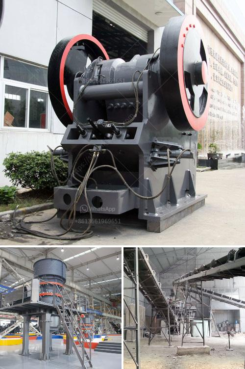

<h3>marble mining equipment</h3>
Marble, a metamorphic rock formed by intense heat and pressure beneath the earth’s crust, is a stunning natural stone that has been used for centuries in various architectural and decorative applications. From ancient sculptures and monuments to modern-day buildings and countertops, marble continues to captivate with its elegance and durability.

Marble mining, however, involves an intricate process that includes extracting large blocks of marble from quarries, as well as using heavy machinery to transport them to factories for fabrication. As with any mining project, there are a variety of factors that determine the success (or failure) of marble extraction. These include site conditions, environmental considerations, infrastructure availability, and, of course, the right type of equipment.

When it comes to marble mining, the most crucial piece of equipment is the marble crusher. This specialized machinery is used to break larger rocks or stones into smaller pieces, thus facilitating the transportation of marble slabs. With the growing demand for marble, the crusher market is witnessing continuous advancements, as new crushers are being developed to enhance crushing efficiency and minimize wastage.

Apart from crushers, there are other important pieces of equipment used in the marble mining process. For instance, the loader is instrumental in loading marble blocks onto trucks for transportation, while diamond wire saws are used to cut through marble efficiently and with minimal waste. In addition, drilling equipment is employed to create holes for the insertion of explosives, which help break down large marble blocks into manageable sizes.

Mining marble also requires precision drilling, which can be achieved through specialized drilling equipment. The drilling process helps extract samples for testing and determines the feasibility of quarrying in a particular area. It is crucial to conduct such tests to gauge the quality and quantity of marble available, as well as to identify any potential geological risks.

While the use of heavy machinery is unavoidable in marble mining, industry leaders are increasingly aware of the environmental impact and are adopting sustainable practices. Measures such as optimizing energy consumption, minimizing wastage in the extraction process, and reusing water are being implemented to mitigate the negative effects of mining on the environment.

In conclusion, marble mining is an intricate process that requires a combination of specialized equipment, skilled labor, and sound environmental practices. As technology continues to advance, mining companies are likely to witness further improvements in marble extraction methods that maximize efficiency and minimize harm to the environment. With the right equipment and responsible practices, the marble mining industry can continue to thrive while preserving the beauty of this precious natural stone.
<h3>Contact us</h3><ul><li><strong>Whatsapp:&nbsp;<a href="https://wa.me/8613661969651">+8613661969651</a></strong></li><li><a href="https://swt.shibang-china.com/?git&amp;zhl&amp;marble mining equipment"><strong>Online Service(chat now)</strong></a></li></ul><h3>Related</h3><ul><li><a href='power calculation hammer mill equation.md'>power calculation hammer mill equation</a></li><li><a href='vibrator screen for coal.md'>vibrator screen for coal</a></li><li><a href='manufacturer of mineral beneficiation plant from china.md'>manufacturer of mineral beneficiation plant from china</a></li><li><a href='hard rock crushers manufacturers india.md'>hard rock crushers manufacturers india</a></li><li><a href='river stone crushing plant for sale.md'>river stone crushing plant for sale</a></li></ul>