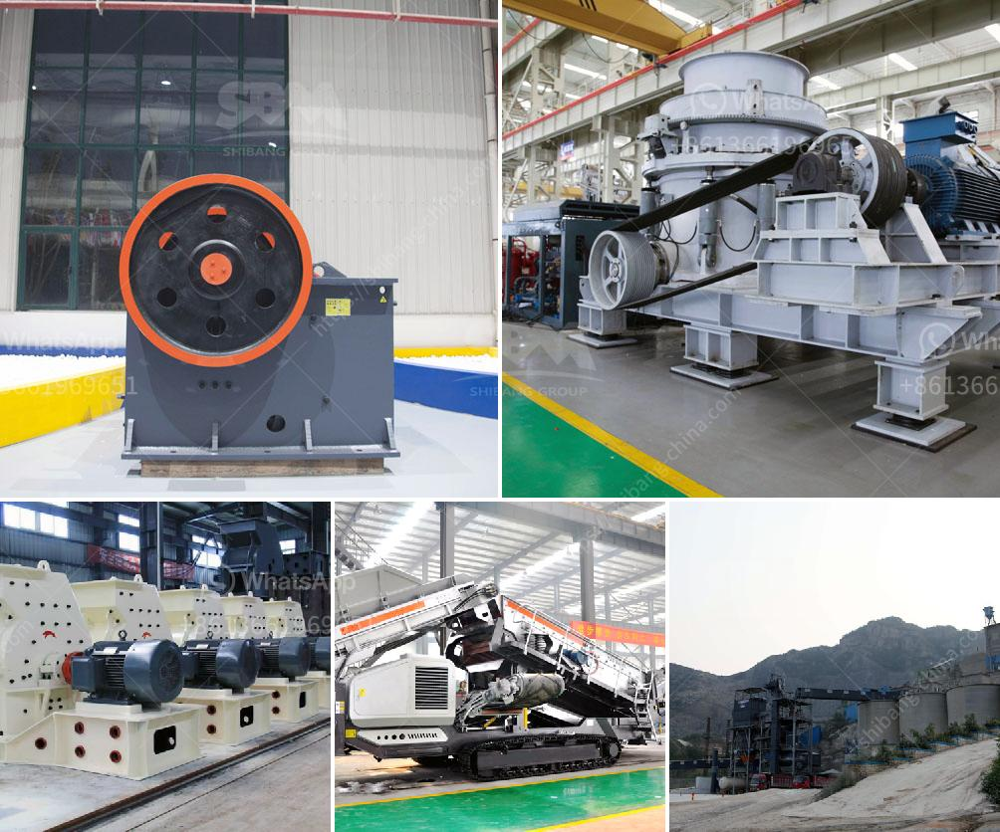

<h3>marble paving making machinry price</h3>
Marble paving has been a staple in the construction industry for centuries, admired for its elegance, durability, and timeless appeal. However, the traditional methods of laying marble pavers can be time-consuming, labor-intensive, and costly. In recent years, the introduction of marble paving making machinery has revolutionized this process, offering a cost-effective and efficient solution for construction projects.

One of the significant advantages of using marble paving making machinery is the reduction in manual labor required. Traditionally, experienced craftsmen were needed to cut, shape, and lay each marble paver individually, a process that often took hours for just a small section. With the introduction of machinery, the time and effort required have been significantly reduced. These machines can automatically cut, shape, and lay marble pavers, enabling faster completion of projects and reducing labor costs.

Another noteworthy benefit of marble paving making machinery is the precise and consistent results it produces. Manual installation can result in variations in size, shape, and alignment of pavers, leading to an uneven appearance. In contrast, the machinery ensures each paver is cut to precise measurements and laid with perfect alignment, resulting in a neat and visually appealing finished product.

When considering the price of marble paving making machinery, it is essential to take into account the initial investment and long-term savings. The initial cost of purchasing the machinery may seem daunting, but the efficiency it brings will save time and labor costs in the long run. Moreover, machine-made marble pavers are less prone to damage during installation, reducing replacement and maintenance expenses.

Marble paving making machinery prices can range from a few thousand dollars to high-end models costing hundreds of thousands. The price is influenced by factors such as the machinery's features, production capacity, and brand reputation. It is essential for construction companies and contractors to assess their specific needs and budget before selecting the most suitable machinery.

In conclusion, marble paving making machinery has transformed the construction industry by streamlining the marble paving process. It offers advantages such as reduced labor costs, precise results, and long-term savings on maintenance. Though the initial investment may vary, the efficiency and quality provided by this machinery make it a worthwhile investment for any construction project. As technology advances further, we can expect even more innovative solutions to emerge in the field of marble paving making machinery.
<h3>Contact us</h3><ul><li><strong>Whatsapp:&nbsp;<a href="https://wa.me/8613661969651">+8613661969651</a></strong></li><li><a href="https://swt.shibang-china.com/?git&amp;zhl&amp;marble paving making machinry price"><strong>Online Service(chat now)</strong></a></li></ul><h3>Related</h3><ul><li><a href='coal roller mill.md'>coal roller mill</a></li><li><a href='hammer mill machine 20hp.md'>hammer mill machine 20hp</a></li><li><a href='pfw impact crusher.md'>pfw impact crusher</a></li><li><a href='komatsu br 380 crusher for sale in malaysia.md'>komatsu br 380 crusher for sale in malaysia</a></li><li><a href='vibrating screen manufacture in philippines.md'>vibrating screen manufacture in philippines</a></li></ul>